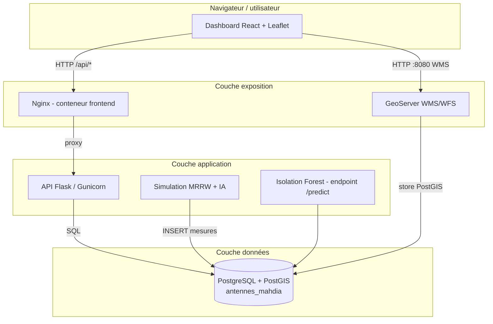
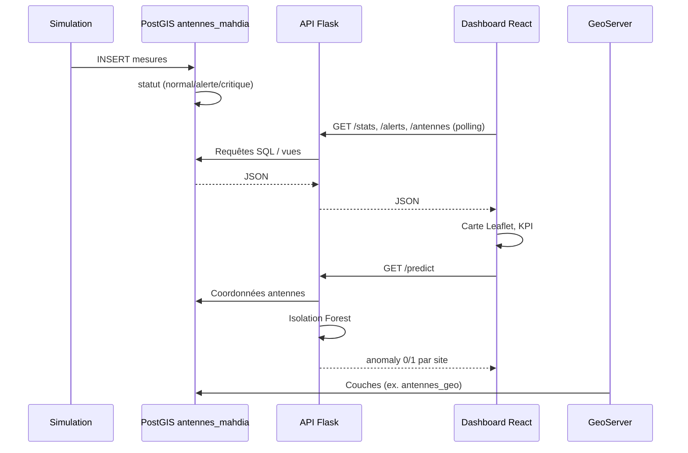
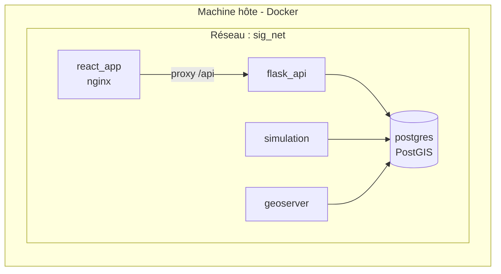

# Architecture — texte et diagrammes alignés sur le dépôt

Ce fichier décrit l’**architecture opérationnelle actuelle** (code + `docker-compose.yml`).  
Exportez les diagrammes Mermaid via [mermaid.live](https://mermaid.live) si besoin pour le rapport.

> **Stack actuelle (mai 2026)** : 5 services Docker — `postgres`, `api`, `simulation`, `frontend`, `geoserver`. **GeoNetwork** et **Grafana** ne font plus partie du dépôt.

---

## Figure 1 — Schéma d’architecture logique

---

## Figure 2 — Flux de données

---

## Figure 3 — Vue conteneurs Docker

**Ports hôte :** 3000 → frontend, 7000 → API, 6000 → PostGIS, 8080 → GeoServer.

---

## Texte — Flux de données (section rapport)

1. **Collecte / simulation** : `simulation/` insère des **mesures** liées aux **antennes** ; le statut est dérivé en base (`init.sql`).
2. **Stockage** : PostGIS (`geom`, SRID 4326), vues `antennes_statut`, `antennes_geo`.
3. **API** : Flask expose JSON (`/antennes`, `/stats`, `/alerts`, `/predict`, incidents, audit…).
4. **Frontend** : React (polling ~60 s), carte Leaflet, couche WMS GeoServer optionnelle.
5. **SIG** : **GeoServer** publie les vues PostGIS ; pas de catalogue GeoNetwork dans la stack actuelle.

---

## Points clés pour la soutenance

- Interface principale : **dashboard React** (port **3000**), API via **`/api`** (nginx → Flask).
- **GeoServer** sur **8080** ; carte en mode dégradé si WMS indisponible.
- Base unique métier : **`antennes_mahdia`** (pas de `geonetwork_db` ni Elasticsearch dans Compose).
