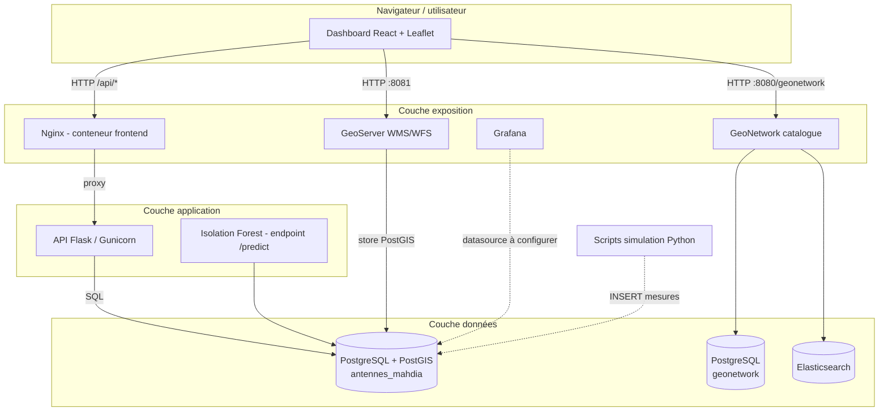
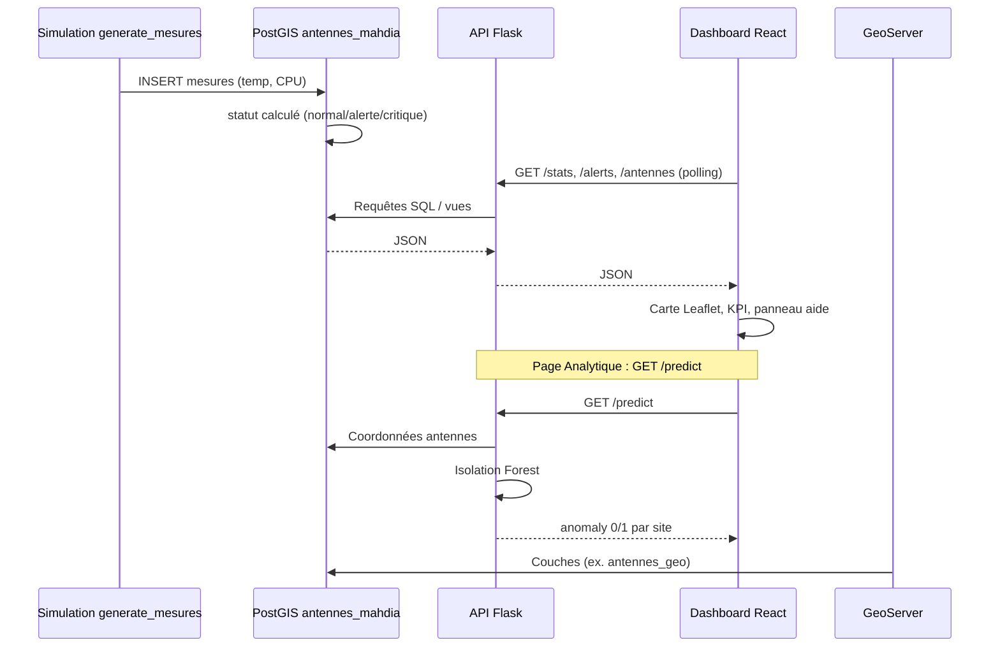
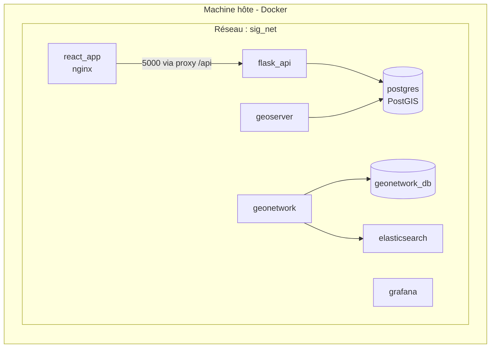

# Architecture — texte et diagrammes corrigés pour le rapport PFE

Ce fichier aligne le **chapitre 2** (architecture globale) sur le **code et `docker-compose.yml` réels**.  
Vous pouvez copier-coller les paragraphes dans Word, et exporter les diagrammes Mermaid (extension *Markdown Preview Mermaid*, ou [mermaid.live](https://mermaid.live)) en **PNG** pour remplacer la figure dans le PDF.

---

## Écarts importants entre l’ancien texte PDF et le projet réel

| Sujet | Texte PDF (à corriger) | Réalité du dépôt |
|--------|-------------------------|------------------|
| Tables métier | « table équipements » | Tables **`antennes`**, **`mesures`**, vues **`antennes_statut`**, **`antennes_geo`** (`database/init.sql`) |
| GeoNetwork ↔ PostgreSQL | GeoNetwork interrogerait la même base que les équipements | **GeoNetwork** utilise **`geonetwork_db`** (PostgreSQL dédié) + **Elasticsearch** pour le catalogue ; ce n’est **pas** la base `antennes_mahdia` |
| Carte / SIG métier | Leaflet côté GeoNetwork | **Leaflet** est dans le **dashboard React** ; **GeoServer** publie les couches PostGIS (WMS/WFS) |
| Client principal | Sous-entendu Grafana seul | **Tableau de bord React** (`frontend`) sur le port **3000**, API via **`/api`** (nginx → Flask) |
| Réseau Docker | `app-net` | **`sig_net`** (bridge) |
| Images / versions | `postgis/postais`, GeoNetwork 4.4 | **`postgis/postgis:15-3.4`**, **`geonetwork:4.2.7`**, **Elasticsearch 7.17.10**, **GeoServer kartoza 2.23.1** |
| Isolation Forest | Score -1/1 dans le JSON | `fit_predict` donne -1 (outlier) / 1 (inlier) en interne ; l’API expose **`anomaly`** : **1** = anomalie spatiale, **0** = normal (`api/app.py`) |
| Grafana | « interroge PostgreSQL » automatiquement | Grafana est dans Compose mais la **connexion datasource** se configure dans l’UI ; ce n’est pas dans le fichier compose |

---

## Figure 1 — Schéma d’architecture logique (corrigé)

---

## Figure 2 — Flux de données (corrigé)

---

## Figure 3 — Vue conteneurs Docker (corrigé)

**Ports typiques (hôte) :** 3000 → dashboard, 5000 → API, 5432 → PostGIS, 8080 → GeoNetwork, 8081 → GeoServer, 3001 → Grafana, 9200 → Elasticsearch.

---

## Texte à remplacer dans le rapport (section 4.2.4 — Flux de données)

**Remplacez** l’ancienne liste par ceci (cohérent avec le code) :

1. **Collecte / simulation des données** : les scripts Python (dossier `simulation/`) insèrent des **mesures** (température, CPU, etc.) dans la table **`mesures`**, liées aux **`antennes`**. Le statut opérationnel (normal, alerte, critique) est **dérivé en base** selon des seuils définis dans `init.sql`.

2. **Stockage** : PostgreSQL avec l’extension **PostGIS** conserve les antennes, l’historique des mesures et la géométrie (**`geom`**, SRID 4326). Des **vues** (`antennes_statut`, `antennes_geo`) exposent la **dernière mesure** par site pour le dashboard et GeoServer.

3. **Exposition REST** : l’**API Flask** interroge la base et fournit des réponses **JSON** (`/stats`, `/alerts`, `/antennes`, `/predict`). Le **dashboard React** consomme ces endpoints (rafraîchissement périodique).

4. **Analyse IA** : l’endpoint **`/predict`** applique **Isolation Forest** sur les coordonnées géographiques des antennes et renvoie, pour chaque site, un indicateur **`anomaly`** (1 = anomalie spatiale détectée, 0 = cas normal), après conversion des labels scikit-learn.

5. **Publication cartographique** : **GeoServer** lit les données spatiales dans PostGIS et les publie en services **OGC** (WMS/WFS). Le **dashboard** utilise **Leaflet** pour la carte interactive.

6. **Catalogue de métadonnées** : **GeoNetwork** s’appuie sur une base **PostgreSQL dédiée** (`geonetwork_db`) et sur **Elasticsearch** pour l’indexation ; il ne remplace pas la base métier `antennes_mahdia`.

7. **Grafana** : service de supervision inclus dans la plateforme ; la connexion à PostgreSQL se **paramètre dans l’interface** Grafana (non figée uniquement par le compose).

---

## Texte à remplacer (section 4.3.4 — Docker)

**Remplacez** les phrases erronées par :

La **vue en conteneurs** illustre le déploiement via **Docker Compose**. Tous les services sont attachés au réseau bridge **`sig_net`**, ce qui permet la résolution DNS par **nom de service** (`postgres`, `flask_api`, `geonetwork`, etc.).

Pour chaque service, le fichier Compose définit notamment : **image** (ex. `postgis/postgis:15-3.4`, `geonetwork:4.2.7`), **variables d’environnement**, **ports** publiés vers l’hôte, **volumes** pour la persistance (`postgres_data`, `geonetwork_data`, …), et **`depends_on`** avec **healthchecks** lorsque nécessaire (ex. GeoNetwork après PostgreSQL catalogue et Elasticsearch opérationnels).

**Corrections de français utiles ailleurs dans le chapitre :**

- « En utilisent trois » → **« Nous utilisons trois »**
- « impliquès » → **« impliqués »**
- « leurs roles » → **« leurs rôles »**
- « Vue en conteneurs éminente » → **« La vue en conteneurs illustre »**
- « dépendront avec des vérifications » → **« depends_on avec des healthchecks »**
- « postgis/postais » → **`postgis/postgis`**

---

## Note pour la soutenance

Si le jury compare le rapport au démo : insistez sur la **séparation** entre **base métier PostGIS** (antennes / mesures) et **stack GeoNetwork** (métadonnées + Elasticsearch), et sur le rôle du **dashboard React** comme interface principale de supervision.
