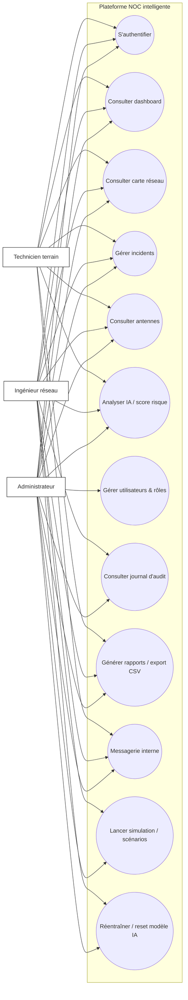
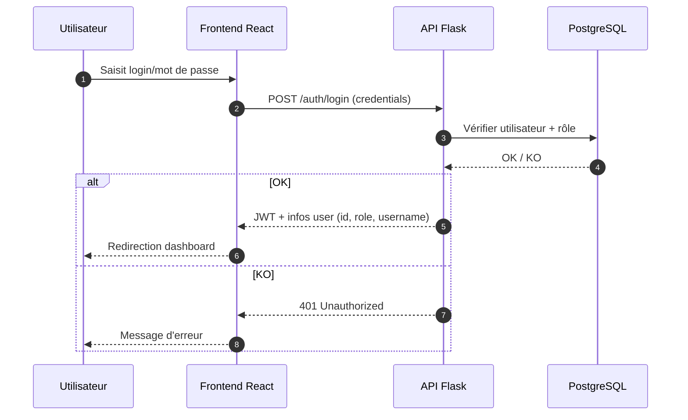
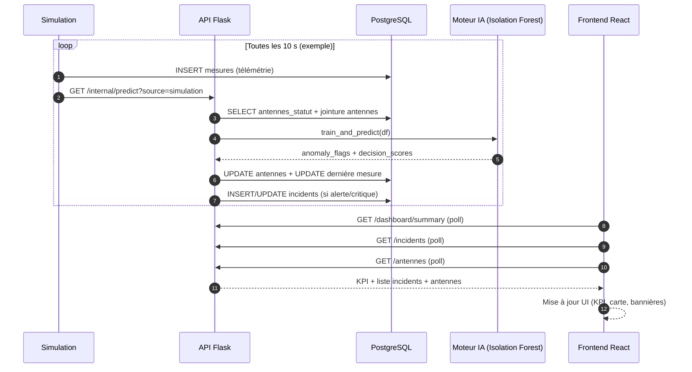

## Chapitre 2 — Analyse des besoins, modélisation UML et conduite du projet (Scrum)

### Introduction du chapitre

Après avoir situé le projet dans son contexte organisationnel, ce chapitre se concentre sur la démarche de conception : capture des besoins, analyse fonctionnelle et non fonctionnelle, modélisation UML et organisation Agile/Scrum. L’objectif n’est pas seulement de “lister” des fonctionnalités, mais de montrer comment elles sont structurées, priorisées et traduites en une architecture logicielle cohérente, adaptée à la supervision télécom.

---

### 2.1 Capture des besoins

#### 2.1.1 Méthode de collecte

La collecte des besoins s’est faite à travers :

- des échanges avec l’encadrant professionnel et les acteurs du centre (ingénieurs, techniciens) ;
- l’observation des informations utiles en supervision (métriques, incidents, état) ;
- l’analyse des limites d’outils classiques (liste d’alarmes sans contextualisation) ;
- la déduction de besoins transverses (sécurité, audit, performance, ergonomie).

Cette approche permet de produire une liste de besoins **réalistes**, orientés terrain, et de les traduire en backlog priorisé.

#### 2.1.2 Besoins fonctionnels (BF)

Les besoins fonctionnels correspondent aux services attendus par l’utilisateur final.

**Tableau 2.1 : Besoins fonctionnels**

| Code | Besoin fonctionnel | Description | Priorité |
|---|---|---|---|
| BF1 | Authentification | Connexion sécurisée (JWT) + rôles | Haute |
| BF2 | Dashboard NOC | KPI temps réel + incidents + tendances | Haute |
| BF3 | Carte réseau (SIG) | Visualiser antennes sur carte + état | Haute |
| BF4 | Gestion des antennes | Liste, détails, historique, statut | Haute |
| BF5 | Gestion des incidents | Création, suivi, résolution, criticité | Haute |
| BF6 | Analyse IA | Détection d’anomalies + score risque + explication | Haute |
| BF7 | Administration | Gestion utilisateurs/rôles + paramétrage | Moyenne |
| BF8 | Journal d’audit | Traçabilité des actions sensibles | Moyenne |
| BF9 | Rapports | Statistiques + export CSV + synthèse | Moyenne |
| BF10 | Messagerie interne | Chat public + messages privés + non lus | Moyenne |
| BF11 | Notifications | Alertes UI + notifications navigateur (chat) | Moyenne |
| BF12 | Simulation temps réel | Génération métriques + scénarios d’incidents | Haute |

#### 2.1.3 Besoins non fonctionnels (BNF)

Les besoins non fonctionnels définissent la qualité attendue.

**Tableau 2.2 : Besoins non fonctionnels**

| Code | Besoin | Justification supervision télécom | Mesure/critère |
|---|---|---|---|
| BNF1 | Sécurité | Accès restreint aux données réseau | JWT + RBAC |
| BNF2 | Disponibilité | Le NOC doit fonctionner en continu | Docker + healthcheck |
| BNF3 | Performance | Rafraîchissement fréquent des KPI/carte | Polling maîtrisé |
| BNF4 | Fiabilité | Cohérence incidents ↔ statuts antennes | Transactions BD |
| BNF5 | Maintenabilité | Évolution facile (nouveaux KPI, pages) | Architecture modulaire |
| BNF6 | Traçabilité | Historiser les actions (qui, quoi, quand) | Journal audit |
| BNF7 | Ergonomie | Lecture rapide et codes couleur | UI/UX moderne |
| BNF8 | Scalabilité (relative) | Augmenter nb d’antennes/mesures | Indexation + pagination |

---

### 2.2 Acteurs du système et contrôle d’accès (RBAC)

Le système est utilisé par plusieurs profils. Une même action (ex. réentraîner le modèle IA) ne doit pas être disponible à tous, pour éviter des dérives et garder une exploitation cohérente.

**Tableau 2.3 : Acteurs et responsabilités**

| Acteur | Rôle | Responsabilités principales |
|---|---|---|
| Administrateur | Gouvernance | Gestion utilisateurs, reset IA, audit, paramétrage |
| Ingénieur réseau | Exploitation | Analyse KPI, suivi incidents, rapports, IA info/retrain |
| Technicien terrain | Intervention | Consultation incidents/antennes, résolution, retours terrain |

---

### 2.3 Modélisation UML

#### 2.3.1 Diagramme de cas d’utilisation global

**Figure 2.1 : Diagramme de cas d’utilisation global**  
[Insérer Diagramme]  
Source : Réalisation personnelle

Diagramme (Mermaid) :



**Analyse de la figure 2.1.**  
Le diagramme met en évidence une plateforme centralisée, utilisée par trois profils. Les cas d’utilisation majeurs (dashboard, carte, incidents, antennes, IA) sont partagés car ils concernent la supervision quotidienne. En revanche, la gestion des utilisateurs et les opérations IA “sensibles” (reset/réentraînement forcé) restent réservées à des rôles spécifiques afin d’éviter des modifications non maîtrisées.

#### 2.3.2 Diagrammes de séquence

##### a) Authentification (Login)

**Figure 2.2 : Diagramme de séquence — Authentification**  
[Insérer Diagramme]  
Source : Réalisation personnelle



##### b) Traitement d’un incident IA (cycle)

**Figure 2.3 : Diagramme de séquence — Détection IA et synchronisation incident**  
[Insérer Diagramme]  
Source : Réalisation personnelle



**Analyse critique.**  
Ce diagramme montre une architecture “data-driven” : l’IA s’exécute après l’arrivée de nouvelles mesures et met à jour la base (statuts + incidents). Le frontend, quant à lui, fonctionne principalement en lecture via polling. Cette stratégie simplifie l’implémentation mais impose de contrôler la fréquence de rafraîchissement pour ne pas surcharger l’API et la BD.

---

### 2.4 Scrum : organisation, backlog et planification

#### 2.4.1 Équipe et rôles Scrum

Dans un contexte PFE, l’équipe est réduite. Cependant, les rôles Scrum restent utiles pour structurer le travail :

- **Product Owner (PO)** : souvent incarné par l’encadrant professionnel (définition des priorités métier).
- **Scrum Master** : rôle assuré par l’étudiant pour la coordination, la gestion du sprint et la résolution de blocages.
- **Équipe de développement** : l’étudiant (ou binôme) qui implémente l’ensemble (frontend, backend, IA).

#### 2.4.2 Backlog produit (extrait)

**Tableau 2.4 : Backlog produit (extrait)**

| User Story | En tant que | Je veux | Afin de | Priorité |
|---|---|---|---|---|
| US1 | Utilisateur | me connecter | sécuriser l’accès | Haute |
| US2 | Ingénieur | voir KPI temps réel | décider rapidement | Haute |
| US3 | Technicien | consulter incidents | planifier intervention | Haute |
| US4 | Ingénieur | voir la carte des antennes | contextualiser géographiquement | Haute |
| US5 | Admin | gérer utilisateurs | contrôler les accès | Moyenne |
| US6 | Ingénieur | détecter anomalies IA | anticiper incidents | Haute |
| US7 | Utilisateur | générer rapport | documenter l’exploitation | Moyenne |
| US8 | Utilisateur | utiliser un chat interne | coordonner actions | Moyenne |

#### 2.4.3 Planification par sprints (exemple)

**Tableau 2.5 : Sprint Planning — Sprint 1 (Backend/BD/SIG/Docker)**

| Tâches | Livrable | Critère d’acceptation |
|---|---|---|
| Modéliser BD | tables antennes/mesures/incidents | CRUD stable |
| Implémenter API Flask | endpoints essentiels | réponses JSON OK |
| Docker Compose | services postgres/api/simulation/frontend | `docker compose up` OK |
| SIG | Leaflet/OSM ou GeoServer | carte affiche antennes |

**Tableau 2.6 : Sprint Planning — Sprint 2 (Frontend React)**

| Tâches | Livrable | Critère d’acceptation |
|---|---|---|
| Login + AuthContext | authentification persistante | accès protégé |
| Dashboard KPI + Recharts | KPI + courbes 12h | rafraîchissement |
| Carte Leaflet | markers + popup + filtre | lisibilité NOC |
| Pages (antennes, incidents, admin) | navigation cohérente | API intégrée |
| Chat interne | public + privé + non lus | notifications |

**Tableau 2.7 : Sprint Planning — Sprint 3 (IA)**

| Tâches | Livrable | Critère d’acceptation |
|---|---|---|
| Prétraitement | pipeline features | robuste aux NA |
| Isolation Forest | entraînement + prédiction | scores cohérents |
| Synchronisation incidents | création/résolution auto | cohérence BD |
| Intégration API | endpoints predict/info/retrain/reset | RBAC respecté |
| Intégration UI | affichage score IA | lisible et utile |

**Tableau 2.8 : Sprint Planning — Sprint 4 (Simulation/IoT/Temps réel)**

| Tâches | Livrable | Critère d’acceptation |
|---|---|---|
| Simulateur | génération métriques régulière | données en BD |
| Scénarios | surcharge, surchauffe, panne | démo jury |
| Flux IoT (optionnel) | clé API + endpoint ingestion | sécurisation |

---

### 2.5 Environnement de développement

L’environnement choisi vise la reproductibilité :

- IDE : VS Code / Cursor
- Backend : Python, Flask, Gunicorn (prod)
- Frontend : React, TypeScript, Tailwind CSS, Recharts, Leaflet
- Base : PostgreSQL + PostGIS
- Déploiement : Docker + Docker Compose
- SIG : GeoServer (optionnel selon intégration)

---

### 2.6 Architecture du système (globale)

**Figure 2.4 : Architecture globale logique**  
[Insérer Schéma]  
Source : Réalisation personnelle

```mermaid
flowchart TB
  FE[Frontend React (Nginx)\nPort 3000] -->|/api/*| API[API Flask (Gunicorn)\nPort 7000]
  API --> DB[(PostgreSQL/PostGIS)\nPort 6000]
  SIM[Service simulation\n(temps réel)] --> DB
  SIM -->|/internal/predict| API
  API --> IA[Module IA\nIsolation Forest]

  subgraph SIG[SIG / Cartographie]
    OSM[OpenStreetMap Tiles]
    LEAF[Leaflet]
    GEOS[GeoServer (optionnel)]
  end

  FE --> LEAF
  LEAF --> OSM
  GEOS --> DB
```

**Analyse.**  
L’architecture est volontairement modulaire : la BD centralise les mesures et statuts, l’API encapsule la logique (y compris IA), la simulation alimente la BD et déclenche des cycles d’analyse, et le frontend consomme en lecture via endpoints sécurisés. Le choix Docker renforce la reproductibilité (soutenance) et simplifie le déploiement.

---

### Conclusion du chapitre 2

Ce chapitre a défini les besoins fonctionnels et non fonctionnels, identifié les acteurs et présenté une modélisation UML de base (cas d’utilisation et séquences). Il a également décrit l’organisation Scrum et l’architecture globale. Les chapitres suivants entrent dans la partie “réalisation” par sprints : d’abord le backend et l’infrastructure (Sprint 1), puis le frontend (Sprint 2) et l’IA (Sprint 3).

