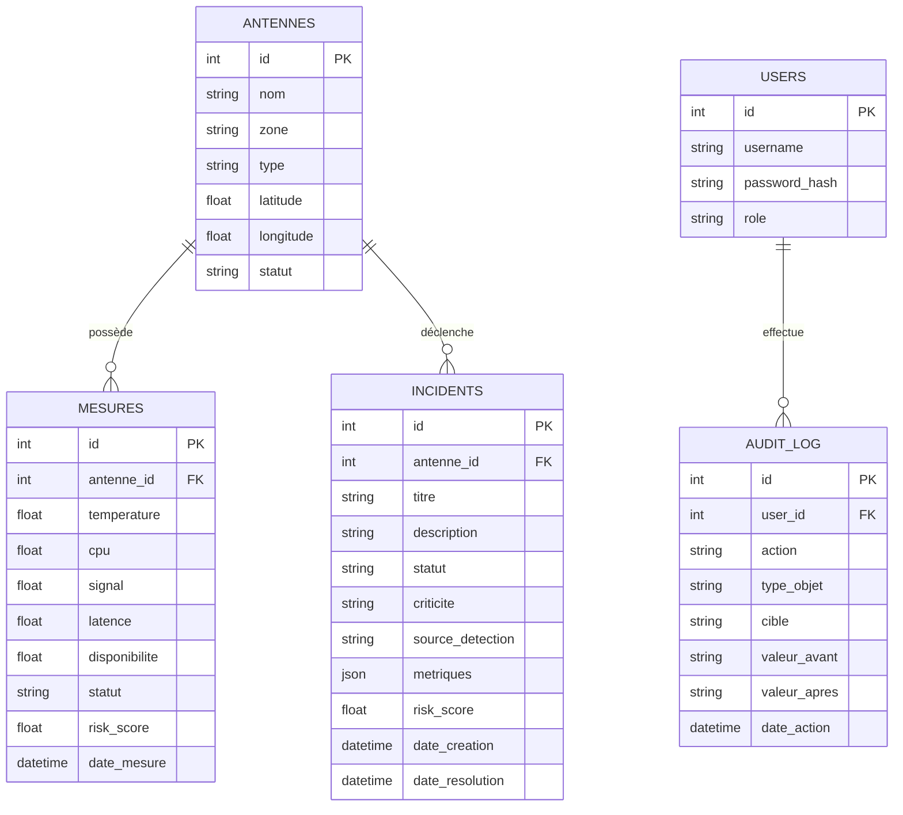

## Chapitre 3 — Sprint 1 : Backend Flask, Base de données PostgreSQL/PostGIS, SIG et Déploiement Docker

### Introduction du chapitre

Le premier sprint constitue la fondation technique du projet. Dans un système de supervision NOC, la fiabilité des données et la stabilité de l’API sont essentielles : si la base et l’API ne sont pas robustes, l’interface de supervision devient rapidement incohérente, ce qui peut induire de mauvaises décisions opérationnelles. Pour cette raison, le Sprint 1 vise à construire une architecture “socle” comprenant :

- une **base de données PostgreSQL/PostGIS** structurée (antennes, mesures, incidents, audit) ;
- une **API REST Flask** modulaire et sécurisée ;
- une **infrastructure Docker** reproductible pour la démonstration et le déploiement ;
- une première approche SIG, intégrée à la chaîne (Leaflet/OSM et/ou GeoServer).

Ce chapitre décrit en détail l’analyse, la conception et la réalisation de ce sprint, en se basant sur la structure réelle du projet.

---

### 3.1 Backlog du sprint (Sprint 1)

Le backlog du Sprint 1 est centré sur l’infrastructure et les fonctionnalités “cœur”.

**Tableau 3.1 : Sprint 1 — Backlog (extrait)**

| ID | User Story / Tâche | Description | Done criteria |
|---|---|---|---|
| S1-1 | Modéliser la BD | Antennes, mesures, incidents, audit | tables créées + contraintes |
| S1-2 | API Flask | Endpoints REST (auth, antennes, incidents, dashboard) | JSON stable + erreurs gérées |
| S1-3 | Docker Compose | 4 services (postgres/api/simulation/frontend) | `docker compose up` OK |
| S1-4 | Healthchecks | vérifier disponibilité services | endpoints `/health` + checks |
| S1-5 | SIG (fondations) | préparer couche géographique | lat/long en BD + endpoints |
| S1-6 | Sécurité initiale | JWT + rôles | endpoints protégés |

---

### 3.2 Analyse : authentification, gestion incidents, API REST

#### 3.2.1 Pourquoi une API REST (et non une logique côté UI) ?

Dans un système NOC, il est crucial d’avoir une source de vérité centralisée. L’API REST permet :

- un **accès unifié** aux données (dashboard, carte, incidents, rapports) ;
- une **séparation des responsabilités** : l’UI affiche, l’API calcule et impose les règles ;
- une **sécurité** contrôlée (JWT, RBAC) ;
- une **traçabilité** (audit) ;
- la possibilité de brancher d’autres consommateurs (simulateur, IoT, scripts).

#### 3.2.2 Choix Flask

Flask est adapté ici car :

- léger et rapide à mettre en place ;
- architecture par **blueprints** (modularité) ;
- intégration simple avec PostgreSQL ;
- disponibilité d’écosystème Python (Scikit-Learn pour IA).

---

### 3.3 Conception : architecture backend et schéma de données

#### 3.3.1 Architecture backend par Blueprints

Le point d’entrée de l’API enregistre plusieurs blueprints (auth, antennes, IA, incidents, etc.). Cette structure favorise :

- la lisibilité du code ;
- l’isolation des modules ;
- l’évolution progressive (ajout de routes sans casser l’existant).

**Figure 3.1 : Schéma de modularité backend (blueprints Flask)**  
[Insérer Schéma]  
Source : Réalisation personnelle

```mermaid
flowchart LR
  APP[app.py\n(Flask App)] --> AUTH[auth_routes]
  APP --> ANT[antennes_routes]
  APP --> INC[incidents_routes]
  APP --> DASH[dashboard_routes]
  APP --> IA[ia routes]
  APP --> CHAT[chat_routes]
  APP --> AUDIT[audit_routes]
  APP --> EXP[export_routes]
  APP --> IOT[iot_routes]
```

**Analyse.**  
La modularité par blueprint réduit le couplage. Elle est particulièrement utile dans un PFE réalisé par sprints : chaque sprint ajoute des fonctionnalités (ex. IA, chat) sans imposer une réécriture globale.

#### 3.3.2 Conception base de données : principes

La base doit :

- stocker la liste des **antennes** avec leurs coordonnées (SIG) ;
- stocker un historique de **mesures** (télémétrie) ;
- conserver des **incidents** structurés (statut, criticité, métriques associées) ;
- enregistrer un **audit** des actions sensibles.

Le choix PostgreSQL/PostGIS permet d’intégrer la dimension géographique (latitude/longitude, requêtes spatiales possibles).

**Figure 3.2 : Schéma relationnel (simplifié)**  
[Insérer Schéma]  
Source : Réalisation personnelle



> Remarque : la structure réelle peut contenir plus de champs (ex. durée estimée incident, “grâce” après résolution, etc.). Le diagramme reste volontairement synthétique pour l’explication.

#### 3.3.3 Stratégie de statut : cohérence antennes ↔ mesures ↔ incidents

Un point critique en supervision est la cohérence des états :

- une antenne possède un **statut global** (normal/alerte/critique/maintenance) ;
- une mesure possède également un statut (lié à l’analyse IA) ;
- un incident correspond à un événement opérationnel, avec son propre statut (en cours/résolu).

La conception choisie adopte une règle simple : le moteur IA met à jour la **dernière mesure** et le **statut antenne**, puis synchronise les incidents (création/résolution). Cette règle évite de réécrire l’historique : les mesures passées restent archivées, ce qui est important pour la traçabilité et les rapports.

---

### 3.4 Réalisation (Backend Flask)

#### 3.4.1 Point d’entrée et bootstrap au démarrage (mode démonstration)

Dans ce projet, un mécanisme de “bootstrap” au démarrage remet le réseau dans un état propre pour la démonstration (121 antennes en normal, incidents clos), selon une variable d’environnement. Cette approche est pertinente en soutenance : elle garantit des scénarios reproductibles, tout en conservant l’historique des mesures.

**Figure 3.3 : Capture — démarrage des services (logs bootstrap)**  
[Insérer Capture]  
Source : Réalisation personnelle

**Analyse de la figure 3.3.**  
Le bootstrap illustre une contrainte “PFE” : fournir un environnement stable au jury. Sur un système industriel, un reset automatique serait plus encadré (validation, fenêtre maintenance). Ici, le mécanisme est contrôlé par une variable `NOC_STARTUP_RESET` afin d’être activé/désactivé.

#### 3.4.2 Endpoint healthcheck

L’API fournit un endpoint `/health` permettant aux healthchecks Docker de vérifier que l’API est opérationnelle.

**Figure 3.4 : Healthcheck API (`GET /health`)**  
[Insérer Capture]  
Source : Réalisation personnelle

**Analyse de la figure 3.4.**  
Ce mécanisme est essentiel en environnement conteneurisé : il permet de redémarrer automatiquement un service en cas de panne et de s’assurer que la pile complète est disponible avant d’exposer le frontend.

#### 3.4.3 Table des endpoints principaux

**Tableau 3.2 : Endpoints REST principaux (extrait)**

| Module | Méthode | Endpoint | Auth | Description |
|---|---:|---|---|---|
| Santé | GET | `/health` | Non | Vérifier service API |
| Auth | POST | `/auth/login` | Non | Récupérer JWT |
| Antennes | GET | `/antennes` | Oui | Liste + métriques + statuts |
| Incidents | GET | `/incidents` | Oui | Liste incidents |
| Dashboard | GET | `/dashboard/summary` | Oui | KPI synthèse |
| IA | GET | `/predict` | Oui | Snapshot IA (lecture BD) |
| IA (interne) | GET | `/internal/predict` | Non | Cycle IA (simulateur) |
| IA | POST | `/ia/retrain` | Rôle | Réentraînement forcé |
| IA | POST | `/ia/reset` | Admin | Reset modèle |
| IA (démo) | POST | `/api/test-ia` | Oui | Injection anomalie (jury) |
| Chat | GET/POST | `/chat/...` | Oui | messages publics/privés |
| Audit | GET | `/audit/...` | Oui | journal d’actions |
| Export | GET | `/export/...` | Oui | export CSV |

> L’objectif du tableau est pédagogique : présenter la surface API et la logique de sécurité.

---

### 3.5 Base de données PostgreSQL/PostGIS

#### 3.5.1 Rôle de PostGIS dans le projet

Même si la carte Leaflet utilise principalement des coordonnées (latitude/longitude), PostGIS permet :

- d’envisager des requêtes spatiales (distance, voisinage) ;
- de préparer une intégration GeoServer (WMS/WFS) ;
- de structurer la donnée SIG dans un SGBD robuste.

#### 3.5.2 Exemple d’exploitation des données

**Figure 3.5 : Capture — table `antennes` (extrait)**  
[Insérer Capture]  
Source : Réalisation personnelle

**Analyse de la figure 3.5.**  
Cette table centralise la description du réseau : identifiant, nom, zone, type et coordonnées. Ces attributs sont ensuite utilisés dans l’UI (popup de carte, filtres) et dans l’IA (contexte géographique).

**Figure 3.6 : Capture — table `mesures` (extrait historique)**  
[Insérer Capture]  
Source : Réalisation personnelle

**Analyse de la figure 3.6.**  
La table des mesures représente la télémétrie : température, CPU, signal, latence, disponibilité, plus un score IA (risk/health score). La présence de `date_mesure` est indispensable pour l’historisation (courbes Recharts, rapports et analyses).

---

### 3.6 SIG : GeoServer et cartographie

Dans le projet, deux approches SIG coexistent conceptuellement :

1) **Approche légère** : Leaflet + OSM, avec marqueurs alimentés par l’API (`GET /antennes`).  
2) **Approche “SIG serveur”** : GeoServer lisant PostGIS et exposant WMS/WFS, superposable sur Leaflet.

Le sprint 1 met surtout l’accent sur le socle (coordonnées en BD + endpoints) et prépare l’extension GeoServer, particulièrement utile si l’on souhaite afficher des couches avancées (zones administratives, heatmaps, buffers).

**Figure 3.7 : Architecture SIG (Leaflet/OSM + option GeoServer)**  
[Insérer Schéma]  
Source : Réalisation personnelle

```mermaid
flowchart LR
  FE[Leaflet (Frontend)] --> OSM[OpenStreetMap tiles]
  FE --> API[API Flask /antennes]
  API --> DB[(PostGIS)]
  FE -. option WMS .-> GEOS[GeoServer]
  GEOS --> DB
```

---

### 3.7 Déploiement : Docker et Docker Compose

#### 3.7.1 Objectifs du déploiement conteneurisé

Docker a été choisi afin de :

- reproduire l’environnement (démonstration au jury) ;
- éviter les dépendances locales non maîtrisées ;
- isoler les services et gérer leurs versions ;
- faciliter l’exécution sur une machine hôte unique.

#### 3.7.2 Services orchestrés

Le système se base sur quatre services principaux :

- `postgres` : PostgreSQL/PostGIS (port hôte 6000)
- `api` : Flask (Gunicorn) (port hôte 7000)
- `simulation` : génération de métriques et déclenchement IA
- `frontend` : React build servi par Nginx (port hôte 3000)

**Tableau 3.3 : Services Docker (ports, rôle, persistance)**

| Service | Port hôte | Rôle | Volume / persistance |
|---|---:|---|---|
| postgres | 6000 → 5432 | stockage données + PostGIS | `postgres_data` + init.sql |
| api | 7000 → 5000 | API REST + logique IA/incident | image build `./api` |
| simulation | — | génération métriques + cycles | image build `./simulation` |
| frontend | 3000 → 80 | UI NOC (SPA) | image build `./dashboard` |

**Figure 3.8 : Capture — services Docker démarrés**  
[Insérer Capture]  
Source : Réalisation personnelle

**Analyse de la figure 3.8.**  
La présence de healthchecks (Postgres et API) renforce la stabilité. De plus, l’API dépend de Postgres “healthy”, ce qui réduit les erreurs de connexion au démarrage. Cette approche est très pertinente pour une soutenance : elle rend le comportement plus déterministe.

#### 3.7.3 Reverse proxy et gestion CORS

Une stratégie classique en SPA consiste à configurer un proxy Nginx afin de router `/api/` vers l’API. Cela :

- simplifie l’URL côté frontend (même origine) ;
- réduit les problèmes CORS ;
- permet de mettre en cache les assets statiques.

**Figure 3.9 : Schéma Nginx (frontend) — routage SPA + API**  
[Insérer Schéma]  
Source : Réalisation personnelle

---

### 3.8 Discussion critique (Sprint 1)

Le sprint 1 apporte une base solide, mais plusieurs limites restent possibles :

- **Pollution de données** : la simulation génère beaucoup de mesures ; une stratégie d’archivage/purge peut être envisagée.
- **Temps réel** : le polling est simple mais peut devenir lourd à grande échelle ; l’évolution vers WebSocket/Server-Sent Events est une perspective.
- **GeoServer** : son intégration complète (styles, couches, sécurité) nécessite un travail spécifique ; elle peut être ajoutée comme amélioration future.
- **Sécurité** : pour un système industriel, on renforcerait (hash passwords robustes, rotation clés, audit complet).

---

### Conclusion du chapitre 3

Ce chapitre a détaillé le Sprint 1 : mise en place de l’API Flask modulaire, conception de la base PostgreSQL/PostGIS, préparation de la cartographie SIG et déploiement via Docker Compose. Ce socle rend possible la supervision en temps réel et prépare l’intégration du frontend, de l’IA et de la simulation. Le chapitre suivant (Sprint 2) se focalise sur l’interface React, l’ergonomie NOC et la cartographie interactive, en détaillant l’architecture des composants, les stratégies de rafraîchissement et l’intégration API.

