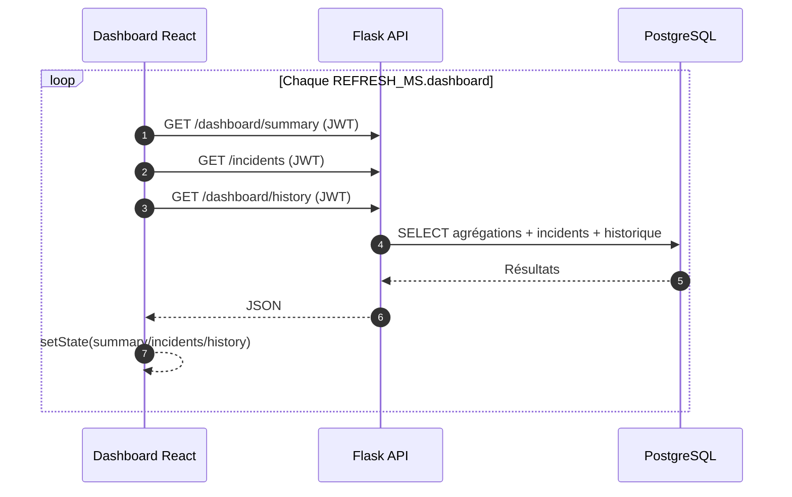
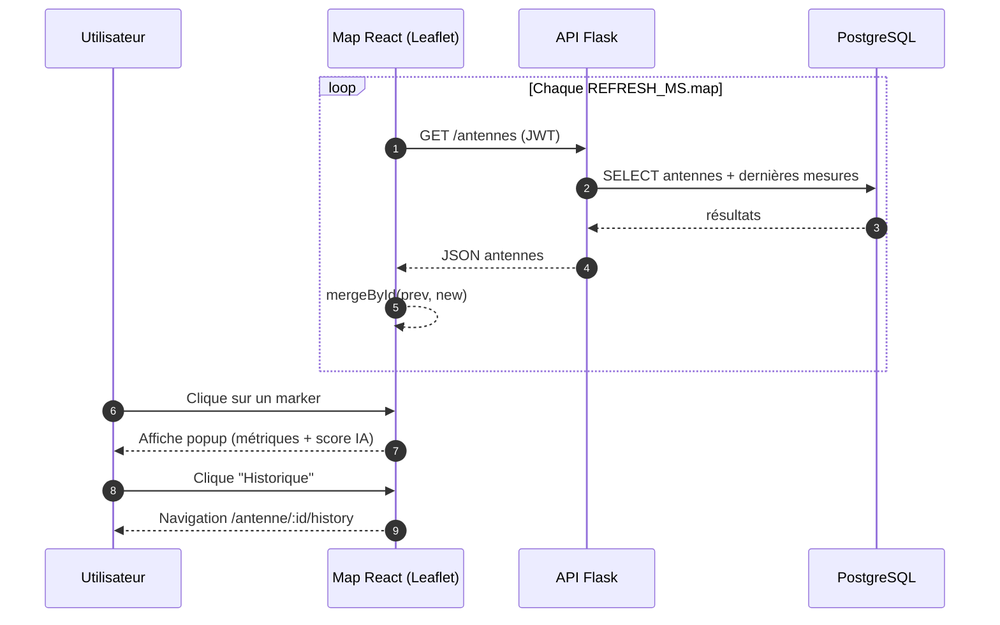
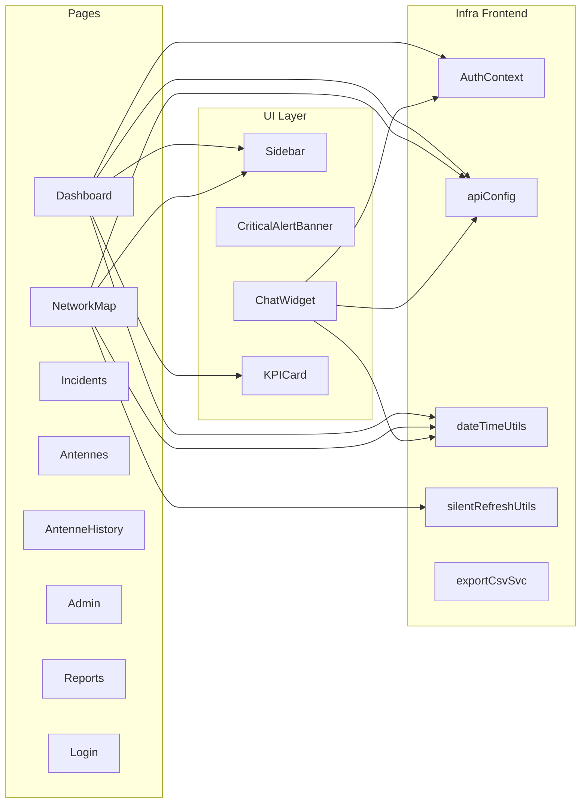
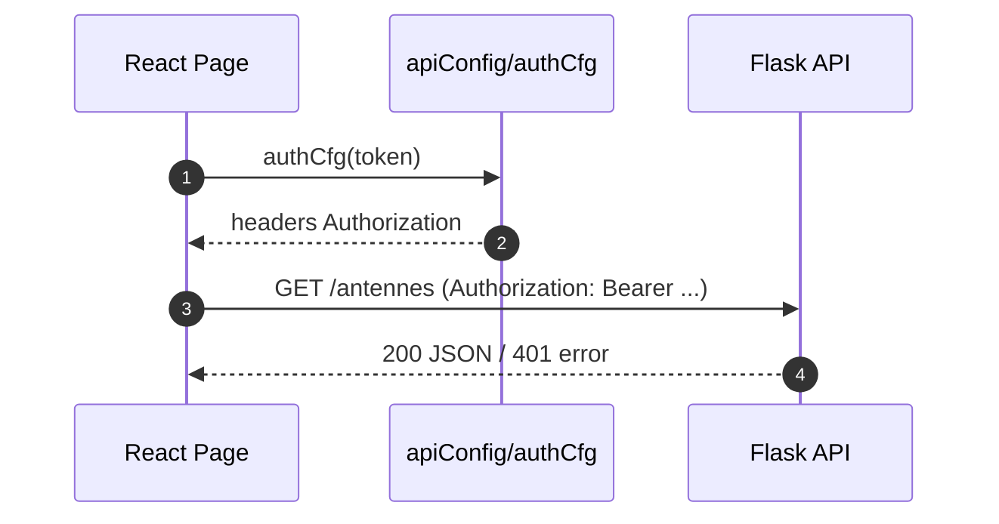
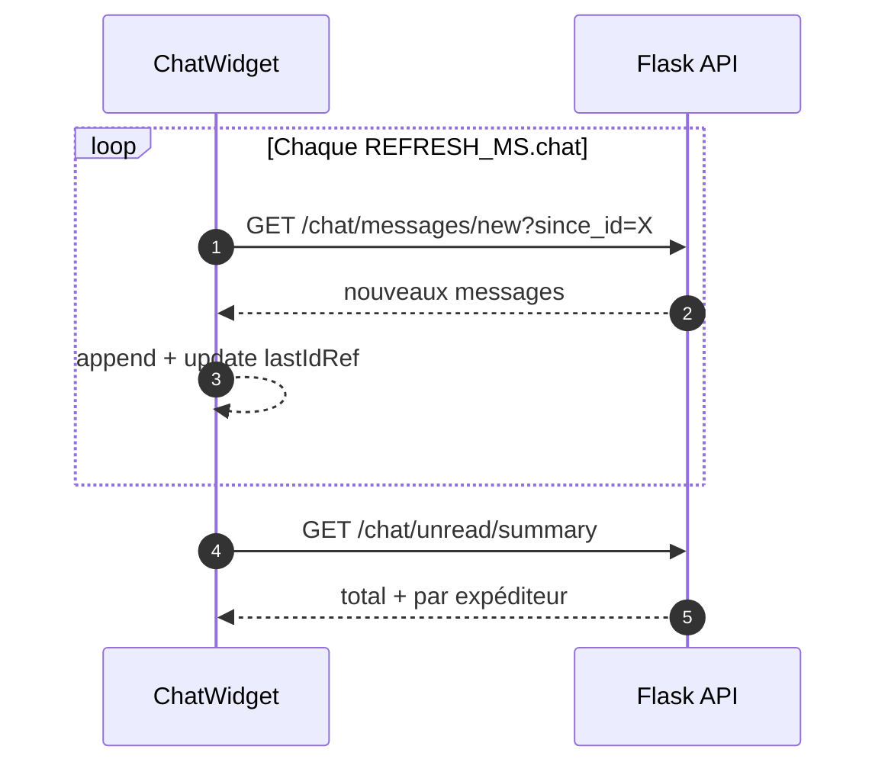

## Chapitre 4 — Sprint 2 : Frontend React, cartographie SIG et UI/UX (chapitre très détaillé)

### Introduction du chapitre

Dans une plateforme NOC, l’interface utilisateur n’est pas un simple “habillage”. Elle constitue le principal outil de décision opérationnelle : l’ingénieur réseau doit comprendre en quelques secondes l’état global, identifier les sites à risque, accéder aux détails, puis déclencher ou suivre les actions de résolution. Une interface mal conçue augmente le temps de compréhension, favorise les erreurs et peut ralentir la coordination.

Ce chapitre détaille la réalisation du **frontend** en **React** (TypeScript/JS selon modules), avec intégration :

- d’un **dashboard NOC** (KPI + incidents + courbes) ;
- d’une **carte SIG** (Leaflet + OpenStreetMap) affichant l’état des antennes ;
- des pages métier (antennes, historique, incidents, rapports, administration) ;
- d’un module de **messagerie interne** (chat public + privé + notifications) ;
- du **contrôle d’accès** via authentification JWT côté UI.

Le chapitre insiste sur les aspects demandés par un rapport académique : analyse des besoins utilisateur, conception UI/UX, architecture React, mécanismes de rafraîchissement temps réel, intégration API et justification des choix.

---

### 4.1 Backlog du sprint (Sprint 2)

**Tableau 4.1 : Sprint 2 — Backlog (extrait)**

| ID | Fonctionnalité | Description | Priorité |
|---|---|---|---|
| S2-1 | Login + AuthContext | Authentification + stockage token + rôle | Haute |
| S2-2 | Routing + pages | Navigation cohérente (SPA) | Haute |
| S2-3 | Dashboard NOC | KPI + incidents + courbes Recharts | Haute |
| S2-4 | Carte réseau | Leaflet + markers + popup + filtre | Haute |
| S2-5 | Antennes + historique | Table + détails + historique métriques | Haute |
| S2-6 | Incidents | Liste + filtres + résolution | Haute |
| S2-7 | Rapports + export | Stats + export CSV | Moyenne |
| S2-8 | Admin | utilisateurs / paramétrage | Moyenne |
| S2-9 | Audit | journal d’audit consultable | Moyenne |
| S2-10 | Messagerie interne | public + privé + non lus + notif | Moyenne |

---

### 4.2 Analyse des besoins utilisateur (côté NOC)

#### 4.2.1 Personas (profil utilisateur)

Pour concevoir une interface pertinente, on définit des profils types :

- **Ingénieur réseau (NOC)** : surveille l’état global, analyse tendances, priorise incidents.
- **Technicien terrain** : consulte incidents affectés, vérifie informations site, confirme résolution.
- **Administrateur** : gère comptes/rôles, supervise audit, force certaines actions (reset IA).

Ces personas partagent des besoins communs (visualiser statut et métriques), mais diffèrent dans leurs droits et leurs actions.

#### 4.2.2 Scénarios d’usage clés

Un NOC est dominé par des scénarios courts et critiques :

- **S1 : prise de poste** — visualiser l’état global (KPI, incidents actifs).
- **S2 : détection** — identifier rapidement les sites critiques et comprendre la cause probable.
- **S3 : localisation** — visualiser sur carte les anomalies d’une zone.
- **S4 : intervention** — suivre l’incident, enregistrer la résolution, vérifier le retour à la normale.
- **S5 : reporting** — générer un rapport de synthèse (jour/semaine), exporter CSV.
- **S6 : coordination** — échanges rapides via chat interne.

Ces scénarios guident le choix des pages et des composants.

---

### 4.3 Conception UI/UX

#### 4.3.1 Principes UI NOC retenus

Plusieurs principes ont été adoptés :

- **Hiérarchiser l’information** : KPI en haut, incidents et tendances ensuite.
- **Codage couleur** : vert = normal, orange = alerte, rouge = critique.
- **Lisibilité** : cartes simples, labels clairs, polices et contrastes adaptés.
- **Action rapide** : liens directs vers carte / historique / incidents.
- **Feedback** : affichage “chargement”, erreurs silencieuses sur polling (éviter spam).
- **Responsive** : adaptation aux écrans (PC NOC, laptop, tablette).

**Tableau 4.2 : Conventions UI et sémantique des couleurs**

| État | Couleur | Sens opérationnel | Action recommandée |
|---|---|---|---|
| Normal | Vert | fonctionnement stable | surveillance standard |
| Alerte | Orange | dégradation modérée | investigation / suivi |
| Critique | Rouge | anomalie forte / panne probable | prioriser intervention |
| Maintenance | Gris | site en maintenance | exclure des alertes |

#### 4.3.2 Navigation : Sidebar et découpage par pages

L’interface est organisée autour d’une **Sidebar** (menu latéral). Cette structure est classique pour un dashboard NOC car :

- elle garde visibles les sections principales ;
- elle réduit le nombre de clics ;
- elle offre un repère constant pour l’utilisateur.

**Figure 4.1 : Capture — Sidebar et navigation principale**  
[Insérer Capture]  
Source : Réalisation personnelle

**Analyse de la figure 4.1.**  
La sidebar facilite la navigation en situation de stress (incident). L’utilisateur accède rapidement au dashboard (vision globale) et à la carte (vision géographique) sans repasser par des menus complexes.

---

### 4.4 Architecture React (composants, hooks, routing, services)

#### 4.4.1 Architecture logique du frontend

Le frontend est conçu selon une architecture “pages + composants + services” :

- **Pages** : écrans complets (Dashboard, Map, Incidents, Admin, Reports, Login).
- **Composants** : éléments réutilisables (Sidebar, bannières, widget chat, etc.).
- **Services** : configuration API (base URL, auth config).
- **Utils** : formatage dates, “silent refresh” (merge), export CSV.
- **Auth Context** : gestion centralisée de session (token, user, role).

**Figure 4.2 : Diagramme composants React (haut niveau)**  
[Insérer Diagramme]  
Source : Réalisation personnelle

```mermaid
flowchart TB
  App[App (Router)] --> Login[Login Page]
  App --> Layout[Layout + Sidebar]
  Layout --> Dashboard[Dashboard Page]
  Layout --> Map[NetworkMap Page]
  Layout --> Incidents[Incidents Page]
  Layout --> Antennes[Antennes Page]
  Layout --> History[AntenneHistory Page]
  Layout --> Admin[Admin Page]
  Layout --> Reports[Reports Page]

  Layout --> Chat[ChatWidget (global)]
  App --> Auth[AuthContext]
  Dashboard --> ApiSvc[apiConfig + axios]
  Map --> ApiSvc
  Incidents --> ApiSvc
  Reports --> ApiSvc
```

#### 4.4.2 Routing (SPA)

Le routing gère l’accès aux pages. L’idée est de protéger les routes par l’authentification : si le token est absent ou expiré, l’utilisateur est renvoyé vers Login.

**Tableau 4.3 : Routes principales (exemple)**

| Route | Page | Accès | Objectif |
|---|---|---|---|
| `/login` | Login | Public | Authentification |
| `/dashboard` | Dashboard | Auth | Vision globale KPI |
| `/map` | Carte | Auth | Vision géographique |
| `/incidents` | Incidents | Auth | Gestion incidents |
| `/antennes` | Antennes | Auth | Catalogue sites |
| `/antenne/:id/history` | Historique | Auth | Courbes par site |
| `/admin` | Admin | Rôle | Gestion utilisateurs/paramètres |
| `/reports` | Rapports | Auth | Statistiques + export |

#### 4.4.3 Stratégie de rafraîchissement (temps réel)

Dans un NOC, le temps réel est important, mais on doit éviter :

- surcharger l’API ;
- créer une UI instable (clignotements, re-render excessif) ;
- perdre les états UI (filtres, scroll).

Le projet utilise une stratégie de **polling** avec intervalles différenciés (ex. dashboard, carte, chat). Certaines pages utilisent une fusion “silencieuse” des données (merge par ID) pour limiter les re-renders agressifs.

**Tableau 4.4 : Rafraîchissement par page (polling)**

| Page / module | Données | Stratégie | Objectif |
|---|---|---|---|
| Dashboard | summary, incidents, history | `Promise.all` + interval | KPI cohérents |
| Carte | antennes | mergeById + interval | limiter clignotement |
| Chat | messages + unread summary | interval + since_id | quasi temps réel |
| Incidents | liste incidents | interval | suivi opérationnel |

**Figure 4.3 : Diagramme de séquence — Polling Dashboard**  
[Insérer Diagramme]  
Source : Réalisation personnelle



---

### 4.5 Réalisation détaillée

Cette section présente les écrans principaux, avec **captures** (emplacements) et analyses détaillées (rôle, fonctionnalités, intégration API, intérêt NOC).

---

#### 4.5.1 Authentification (Login + AuthContext)

L’authentification est la porte d’entrée. Elle doit être simple et sécurisée :

- saisie identifiant/mot de passe ;
- récupération d’un JWT ;
- stockage contrôlé (context) ;
- redirection vers dashboard ;
- gestion d’erreurs (401, session expirée).

**Figure 4.4 : Page Login (authentification)**  
[Insérer Capture]  
Source : Réalisation personnelle

**Analyse de la figure 4.4.**  
La page login limite l’accès aux données de supervision. Dans une plateforme NOC, même dans un contexte PFE, la séparation des accès est indispensable car les informations (incidents, performance) sont sensibles. L’UI offre un feedback clair en cas d’erreur d’authentification et initialise le contexte utilisateur (username, rôle) utilisé ensuite dans le chat et l’audit.

---

#### 4.5.2 Dashboard NOC (KPI + incidents + courbes Recharts)

Le dashboard a pour objectif de fournir une **synthèse immédiate**. Dans le projet, il affiche notamment :

- nombre de sites normaux ;
- disponibilité réseau moyenne ;
- nombre de sites critiques et en alerte (IA) ;
- score global de risque IA ;
- graphique de disponibilité sur 12h ;
- liste des incidents actifs.

**Figure 4.5 : Tableau de bord NOC (vue globale)**  
[Insérer Capture]  
Source : Réalisation personnelle

**Analyse de la figure 4.5.**  
Comme illustré dans la figure 4.5, le tableau de bord NOC affiche en temps réel les indicateurs principaux du réseau supervisé. Les KPI traduisent un état réseau en langage opérationnel : un ingénieur peut identifier rapidement si l’état est stable (beaucoup de sites normaux, disponibilité élevée) ou s’il existe un risque (sites critiques, score IA). L’intégration avec l’API se fait via plusieurs endpoints en parallèle afin de réduire le temps d’attente côté UI.

**Figure 4.6 : Détail des KPI (cartes) et sémantique des couleurs**  
[Insérer Capture]  
Source : Réalisation personnelle

**Analyse de la figure 4.6.**  
Les cartes KPI utilisent des codes couleur cohérents avec les états “normal/alerte/critique”. Cette cohérence est essentielle : elle évite une confusion entre pages (dashboard, carte, incidents). Les icônes (RadioTower, ShieldAlert, BrainCircuit…) améliorent la reconnaissance visuelle et réduisent le temps de lecture.

**Figure 4.7 : Graphique Recharts — Disponibilité (12h)**  
[Insérer Capture]  
Source : Réalisation personnelle

**Analyse de la figure 4.7.**  
Le graphique de disponibilité illustre l’évolution temporelle. Dans un NOC, la tendance est souvent plus informative que la valeur instantanée : une baisse progressive peut annoncer un incident. L’intégration Recharts permet une visualisation fluide et responsive, avec tooltip détaillé facilitant l’analyse sans surcharger l’écran.

**Figure 4.8 : Liste des derniers incidents actifs**  
[Insérer Capture]  
Source : Réalisation personnelle

**Analyse de la figure 4.8.**  
La liste des incidents est présentée avec la criticité et l’heure de création, ce qui aide à prioriser. Le NOC doit distinguer une alerte “warning” d’un incident “critical”. L’UI affiche également des informations de localisation (zone, antenne) pour préparer une intervention et faciliter l’escalade.

---

#### 4.5.3 Carte réseau SIG (Leaflet + OpenStreetMap)

La carte réseau répond à une exigence majeure : visualiser la supervision dans son contexte géographique. Elle s’appuie sur :

- **Leaflet** pour l’interactivité ;
- **OpenStreetMap** pour les tuiles ;
- des marqueurs colorés selon le statut ;
- des popups affichant métriques et score IA ;
- un filtrage par statut (tous/normal/alerte/critique).

**Figure 4.9 : Carte réseau (vue globale)**  
[Insérer Capture]  
Source : Réalisation personnelle

**Analyse de la figure 4.9.**  
La carte permet de repérer immédiatement une concentration d’anomalies. Cette visualisation est particulièrement utile lorsque plusieurs sites d’une même zone passent en alerte : cela peut indiquer une cause commune (panne électrique locale, incident transmission). L’interface réduit la charge cognitive par rapport à une liste brute.

**Figure 4.10 : Popup d’une antenne (métriques + score IA + lien historique)**  
[Insérer Capture]  
Source : Réalisation personnelle

**Analyse de la figure 4.10.**  
Le popup combine métriques brutes (température, CPU, disponibilité) et score IA. Cette association est importante : l’IA donne une synthèse (score), mais l’opérateur peut vérifier immédiatement les valeurs à l’origine de l’anomalie. Le lien “Historique” accélère l’investigation, car l’utilisateur passe directement à l’évolution temporelle du site.

**Figure 4.11 : Filtres carte (chips) — Tous/Normaux/Alertes/Critiques**  
[Insérer Capture]  
Source : Réalisation personnelle

**Analyse de la figure 4.11.**  
Les filtres permettent d’adapter la carte à la tâche : en mode incident, l’opérateur peut afficher uniquement les critiques pour éviter le bruit visuel. L’indication du nombre de sites par état rend la carte aussi informative qu’un KPI.

---

#### 4.5.4 Gestion des antennes et historique

Le module antennes vise la consultation détaillée :

- tableau des antennes (tri, recherche, filtre) ;
- détails (zone, type, coordonnées, statut) ;
- historique des mesures (courbes).

**Figure 4.12 : Page Antennes (table + recherche)**  
[Insérer Capture]  
Source : Réalisation personnelle

**Analyse de la figure 4.12.**  
Le tableau des antennes constitue une alternative à la carte : certains opérateurs préfèrent un format tabulaire pour des recherches rapides (nom, zone). L’API fournit une liste unifiée incluant statut et dernières métriques, ce qui évite une multiplication des requêtes.

**Figure 4.13 : Historique d’une antenne (courbes métriques)**  
[Insérer Capture]  
Source : Réalisation personnelle

**Analyse de la figure 4.13.**  
L’historique est indispensable pour distinguer un incident ponctuel d’une dérive lente. Par exemple, une hausse progressive de température peut annoncer une panne de ventilation. Les courbes donnent un support décisionnel : faut-il intervenir immédiatement ou surveiller ?

---

#### 4.5.5 Gestion des incidents (liste, criticité, résolution)

Un incident est un objet opérationnel. L’UI doit :

- afficher les incidents actifs ;
- permettre le filtrage (statut, criticité) ;
- offrir une action de résolution (selon rôle) ;
- afficher les métriques associées.

**Figure 4.14 : Page Incidents (liste + filtres)**  
[Insérer Capture]  
Source : Réalisation personnelle

**Analyse de la figure 4.14.**  
La page incidents est la zone “action” du NOC. Elle complète le dashboard : le dashboard résume, tandis que la page incidents permet une gestion détaillée (qui est affecté, depuis quand, quel type). L’intégration API s’appuie sur des endpoints incident dédiés et une cohérence avec les statuts IA.

**Figure 4.15 : Détail incident / action de résolution**  
[Insérer Capture]  
Source : Réalisation personnelle

**Analyse de la figure 4.15.**  
La résolution d’un incident doit mettre à jour plusieurs éléments : statut incident (résolu), statut antenne et dernière mesure (retour normal), audit de l’action. C’est pourquoi l’UI déclenche une action API qui encapsule la logique métier. Cette encapsulation réduit le risque d’incohérence si l’on modifie ensuite le moteur IA.

---

#### 4.5.6 Administration (utilisateurs, antennes, audit)

Le module administration est réservé à des rôles supérieurs. Les fonctionnalités typiques :

- création/modification utilisateurs ;
- attribution des rôles ;
- consultation audit ;
- actions sensibles (reset IA, retrain).

**Figure 4.16 : Page Administration (gestion utilisateurs)**  
[Insérer Capture]  
Source : Réalisation personnelle

**Analyse de la figure 4.16.**  
L’administration sécurise le système en limitant les actions. En contexte télécom, la gestion des rôles est essentielle : un technicien ne doit pas pouvoir réinitialiser un modèle IA ou modifier des comptes. Cette page illustre l’application du RBAC côté API et côté UI.

**Figure 4.17 : Journal d’audit (traçabilité)**  
[Insérer Capture]  
Source : Réalisation personnelle

**Analyse de la figure 4.17.**  
Le journal d’audit répond à un besoin transversal : comprendre “qui a fait quoi et quand”. Dans un NOC, la traçabilité est critique pour expliquer une résolution, un changement de statut, ou pour analyser a posteriori les actions effectuées lors d’un incident majeur.

---

#### 4.5.7 Rapports et export CSV

Le module rapports vise la synthèse et la documentation :

- statistiques globales (incidents par période, disponibilité moyenne, etc.) ;
- export CSV pour analyse externe (Excel, BI).

**Figure 4.18 : Page Rapports (statistiques + graphiques)**  
[Insérer Capture]  
Source : Réalisation personnelle

**Analyse de la figure 4.18.**  
Les rapports permettent de passer du temps réel à l’analyse “gestion”. Dans un centre technique, ces rapports sont utiles pour la planification, la justification d’interventions, et le suivi de performance. L’export CSV assure une compatibilité avec des outils externes et répond au besoin de partage.

**Figure 4.19 : Export CSV (téléchargement)**  
[Insérer Capture]  
Source : Réalisation personnelle

**Analyse de la figure 4.19.**  
L’export CSV est volontairement simple : l’objectif est de rendre les données exploitables, sans imposer un format propriétaire. Dans un environnement réel, ce module pourrait évoluer vers PDF, tableaux croisés et intégration BI.

---

#### 4.5.8 Messagerie interne (Chat public + privé + notifications)

La coordination est un besoin concret : lors d’un incident, l’équipe NOC doit communiquer. Le projet intègre un widget de chat :

- canal public (annonces, coordination générale) ;
- messages privés (technicien ↔ ingénieur) ;
- gestion des non lus ;
- notifications navigateur (optionnelles) ;
- affichage du rôle par couleur (admin/ingénieur/technicien).

**Figure 4.20 : Widget Chat (canal public)**  
[Insérer Capture]  
Source : Réalisation personnelle

**Analyse de la figure 4.20.**  
Le widget de chat est pensé comme un composant global, disponible sur plusieurs pages. Cela correspond à un besoin NOC : communiquer sans quitter la supervision. L’affichage des rôles réduit l’ambiguïté sur l’autorité de l’auteur (par exemple, un message d’un administrateur peut contenir une consigne prioritaire).

**Figure 4.21 : Messages privés (liste utilisateurs)**  
[Insérer Capture]  
Source : Réalisation personnelle

**Analyse de la figure 4.21.**  
Les messages privés favorisent la coordination ciblée, notamment entre ingénieur réseau et technicien terrain. La présence d’un badge “non lus” est importante : elle évite de rater un message critique lorsque l’utilisateur est sur la carte ou le dashboard.

**Figure 4.22 : Notification navigateur — nouveau message**  
[Insérer Capture]  
Source : Réalisation personnelle

**Analyse de la figure 4.22.**  
La notification navigateur illustre une amélioration de l’expérience : si l’utilisateur n’a pas le widget ouvert, il est informé. Cette fonction est utile en NOC (multi-écrans) et montre l’intérêt d’un “quasi temps réel” sans WebSocket (polling + notification).

---

### 4.6 Diagrammes UML spécifiques Frontend

#### 4.6.1 Diagramme de séquence Frontend ↔ API (carte)

**Figure 4.23 : Diagramme de séquence — Carte réseau (polling + popup)**  
[Insérer Diagramme]  
Source : Réalisation personnelle



#### 4.6.2 Diagramme de composants (détaillé)

**Figure 4.24 : Diagramme de composants UI (détaillé)**  
[Insérer Diagramme]  
Source : Réalisation personnelle



---

### 4.7 Analyse critique (Sprint 2)

#### 4.7.1 Forces

- UI structurée et cohérente (sidebar, codes couleur).
- Cartographie intégrée (Leaflet/OSM), très pertinente en supervision.
- Dashboard KPI + Recharts apporte une vision synthétique et temporelle.
- Chat interne répond à un besoin de coordination.
- Architecture modulaire (pages/composants/services) facilite l’évolution.

#### 4.7.2 Limites et pistes d’amélioration

- **Polling** : simple mais peut devenir coûteux si le réseau augmente. Évolution possible : WebSocket/SSE.
- **Accessibilité** : à renforcer (navigation clavier, contrastes) pour un produit final.
- **Gestion offline** : non prioritaire en NOC, mais utile en cas de perte de connexion (messages clairs).
- **Personnalisation** : filtres avancés, dashboards personnalisés par rôle.

---

### Conclusion du chapitre 4

Le Sprint 2 a produit une interface NOC complète, intégrant dashboard, cartographie SIG, gestion des entités métier (antennes, incidents), reporting et messagerie. L’architecture React (AuthContext, services API, polling maîtrisé) permet une intégration fluide avec l’API Flask et les données en base. Le chapitre suivant traite du cœur intelligent du système : le moteur IA basé sur Isolation Forest, sa conception, son entraînement, sa synchronisation avec les incidents et son intégration dans l’interface.

---

### 4.8 Compléments techniques (implémentation React) — approfondissement

Cette section apporte un niveau de détail supplémentaire, souvent attendu dans un mémoire de licence : elle explique comment certaines décisions d’implémentation contribuent directement aux objectifs NOC (lisibilité, stabilité, rapidité).

#### 4.8.1 Découpage Dashboard : KPI réutilisables et tooltips pédagogiques

Le dashboard utilise des composants simples et réutilisables :

- `KPICard` : composant de carte KPI, paramétrable (titre, valeur, sous-titre, icône, couleur).
- `ChartTooltip` : composant tooltip pour Recharts, améliorant la lecture sans surcharger le graphe.

L’intérêt pédagogique est double :

- la réutilisabilité réduit la duplication de code et facilite l’ajout de nouveaux KPI (ex. taux d’incidents, moyenne latence) ;
- le tooltip améliore la précision de lecture (valeur exacte à un instant), utile pour l’analyse NOC.

**Figure 4.25 : Capture — survol tooltip du graphique (valeurs instantanées)**  
[Insérer Capture]  
Source : Réalisation personnelle

**Analyse de la figure 4.25.**  
Le survol permet à l’ingénieur d’identifier un moment précis de dégradation (par exemple une chute de disponibilité à 14h20). Dans un NOC, ce détail aide à corréler l’événement avec un incident, une maintenance ou une panne électrique.

#### 4.8.2 Optimisation de la stabilité UI : “silent refresh” (fusion par identifiant)

La carte utilise une fusion `mergeById(prev, next)` (concept de “silent refresh”), ce qui vise à :

- limiter les re-renders agressifs ;
- éviter la sensation de “clignotement” lorsque les données se rafraîchissent ;
- conserver certaines micro-interactions (ex. popup ouvert, zoom) autant que possible.

Ce point est important dans une interface NOC : la stabilité visuelle est un facteur de confiance.

**Tableau 4.5 : Problèmes UI possibles en temps réel et solutions**

| Problème | Impact NOC | Stratégie adoptée |
|---|---|---|
| clignotement de la carte | fatigue visuelle | mergeById + rafraîchissement contrôlé |
| KPI “sautent” | confusion | UI hiérarchisée + formatting stable |
| erreurs réseau fréquentes | bruit (popups) | gestion d’erreurs silencieuse sur polling |
| latence API | UI “figée” | chargement progressif + fallback `—` |

#### 4.8.3 Génération d’icônes Leaflet et sémantique des statuts

Pour renforcer la lisibilité, les marqueurs Leaflet sont personnalisés :

- couleur selon statut (`normal`, `alerte`, `critique`, `maintenance`) ;
- effet “pulse” sur `critique` pour attirer l’attention ;
- popup enrichi avec métriques.

**Figure 4.26 : Capture — marqueur “critique” (effet pulse)**  
[Insérer Capture]  
Source : Réalisation personnelle

**Analyse de la figure 4.26.**  
Dans un NOC, l’attention est une ressource limitée. L’effet pulse permet de repérer un site critique même si la carte contient des dizaines de marqueurs. L’objectif n’est pas esthétique, mais opérationnel.

#### 4.8.4 Service API et gestion d’authentification côté client

Le frontend centralise la configuration API :

- `API_BASE_URL` : base URL unique (souvent `/api` via proxy Nginx).
- `authCfg(token)` : construction des en-têtes avec `Authorization: Bearer <token>`.

Cette centralisation apporte :

- cohérence des requêtes ;
- réduction d’erreurs (oubli header) ;
- facilité de maintenance (changement d’URL).

**Figure 4.27 : Diagramme de séquence — requête authentifiée (header JWT)**  
[Insérer Diagramme]  
Source : Réalisation personnelle



#### 4.8.5 Gestion temps réel du chat : “since_id” et non-lus

La messagerie adopte une approche pragmatique :

- on récupère les nouveaux messages via `since_id` (évite de recharger tout l’historique) ;
- on maintient un compteur de non-lus, y compris par expéditeur pour les messages privés ;
- on notifie l’utilisateur si le widget est fermé.

**Figure 4.28 : Diagramme de séquence — chat (poll nouveaux messages)**  
[Insérer Diagramme]  
Source : Réalisation personnelle



#### 4.8.6 Tests (niveau PFE) et validation fonctionnelle

Dans un PFE, l’évaluation peut se faire via une stratégie de tests simple mais structurée :

- tests manuels guidés par scénarios (login, injection IA, visualisation carte, résolution incident) ;
- validation des flux (simulation → IA → incident → UI) ;
- vérification des droits (un rôle “technicien” ne doit pas accéder à certaines actions).

**Tableau 4.6 : Plan de test fonctionnel (extrait)**

| Cas | Étapes | Résultat attendu |
|---|---|---|
| T1 | login correct | token obtenu + accès dashboard |
| T2 | accès sans token | redirection login |
| T3 | injection anomalie IA | antenne passe critique + incident créé |
| T4 | carte filtre “critique” | affichage uniquement sites critiques |
| T5 | chat privé | message reçu + non-lus + notification |

---

### 4.9 Catalogue de captures (Sprint 2) et analyses détaillées (format mémoire)

Cette section fournit des emplacements de captures d’écran “prêtes à insérer”, avec une analyse structurée conforme à un mémoire tunisien. Elle permet également d’atteindre un volume riche en figures (exigence : 35+).

> Les captures doivent être prises sur l’application en exécution (`frontend` sur le port 3000) et insérées dans le document final.

#### 4.9.1 Authentification

**Figure 4.29 : Formulaire de connexion (Login) — état initial**  
[Insérer Capture]  
Source : Réalisation personnelle

Analyse :  
Le formulaire de connexion constitue la première barrière de sécurité. Sur le plan UI, il doit être minimaliste pour limiter les erreurs de saisie et réduire le temps d’accès. Sur le plan technique, il initie une session via JWT : l’utilisateur ne peut consulter ni la carte ni les incidents tant que le token n’est pas acquis.

L’intégration API se fait via une requête `POST` vers l’endpoint d’authentification, avec gestion d’erreur. Dans un contexte de supervision, cette étape garantit que les données réseau restent accessibles uniquement aux profils autorisés.

**Figure 4.30 : Message d’erreur de connexion (identifiants invalides)**  
[Insérer Capture]  
Source : Réalisation personnelle

Analyse :  
L’affichage d’un message d’erreur clair est essentiel pour éviter les tentatives répétées et réduire le temps perdu. L’UI doit éviter d’exposer des informations sensibles (ex. “utilisateur existe mais mot de passe incorrect”) et fournir un feedback générique.

Du point de vue NOC, un message d’erreur pertinent améliore la continuité : l’opérateur comprend immédiatement s’il s’agit d’une erreur de saisie ou d’une session expirée.

#### 4.9.2 Tableau de bord

**Figure 4.31 : Dashboard NOC — vue globale (KPI + incidents + courbe)**  
[Insérer Capture]  
Source : Réalisation personnelle

Analyse :  
Cette capture synthétise l’information principale. Le dashboard remplit une fonction de “radar” : sans naviguer ailleurs, l’opérateur sait si la situation est stable ou critique. Les KPI sont construits pour être directement actionnables (nombre de sites critiques, score IA).

Techniquement, le dashboard agrège plusieurs sources API en parallèle (summary, incidents, historique). Ce choix réduit la latence UI et offre une cohérence temporelle (même cycle de poll).

**Figure 4.32 : Carte KPI “Score de Risque IA” et interprétation**  
[Insérer Capture]  
Source : Réalisation personnelle

Analyse :  
Le “score de risque IA” transforme un signal technique complexe en indicateur simple. Ce score ne remplace pas l’analyse, mais oriente l’attention. Dans un NOC, la priorisation est un enjeu majeur ; un score global aide à décider s’il faut basculer immédiatement sur la carte/les incidents.

L’API fournit ce score à partir des statuts en base ; le frontend ne calcule pas l’IA, il l’expose.

**Figure 4.33 : Liste “Derniers incidents” avec criticité**  
[Insérer Capture]  
Source : Réalisation personnelle

Analyse :  
La criticité (warning/critical) permet de distinguer une dégradation d’une panne probable. L’UI met en avant le titre, la zone et la date, ce qui facilite l’escalade et la coordination terrain.

Cette liste, alimentée par l’API, met en évidence l’intégration IA → incident : lorsqu’un site devient critique, un incident apparaît automatiquement.

#### 4.9.3 Carte SIG (Leaflet/OSM)

**Figure 4.34 : Carte réseau — distribution spatiale des statuts**  
[Insérer Capture]  
Source : Réalisation personnelle

Analyse :  
La distribution spatiale est informative : un groupement de sites critiques peut indiquer un incident de zone. La carte offre une lecture intuitive, souvent plus rapide qu’une liste.

L’intégration OSM/Leaflet garantit une base cartographique fiable et légère. Le NOC peut rapidement zoomer/dézoomer et localiser les sites à risque.

**Figure 4.35 : Popup d’une antenne — métriques + score IA**  
[Insérer Capture]  
Source : Réalisation personnelle

Analyse :  
Le popup joue le rôle de “fiche synthèse”. Il rassemble les métriques principales (température, CPU, disponibilité, score IA) et évite une navigation excessive. L’opérateur peut décider si l’anomalie est plausible (ex. température anormalement élevée).

Le lien “Historique” constitue un raccourci indispensable : on passe de l’analyse instantanée à l’analyse temporelle.

**Figure 4.36 : Filtre carte — affichage uniquement des sites critiques**  
[Insérer Capture]  
Source : Réalisation personnelle

Analyse :  
Le filtrage réduit le bruit visuel. Dans un incident majeur, l’opérateur doit se concentrer sur les sites critiques. Cette interaction UI simple a un impact direct sur l’efficacité de supervision.

La logique de filtre est côté client (sur le tableau reçu), ce qui évite des requêtes multiples.

#### 4.9.4 Antennes et historique

**Figure 4.37 : Page Antennes — table, statut, métriques clés**  
[Insérer Capture]  
Source : Réalisation personnelle

Analyse :  
La page Antennes sert au diagnostic systématique : elle permet de rechercher un site par nom/zone, et d’obtenir l’état sans passer par la carte. L’affichage des métriques “dernier état” est utile pour comparer plusieurs antennes.

Du point de vue API, cette page dépend de l’endpoint `GET /antennes` qui centralise les informations (coordonnées + métriques + score).

**Figure 4.38 : Historique d’une antenne — courbe CPU/Temp/Latence/Dispo**  
[Insérer Capture]  
Source : Réalisation personnelle

Analyse :  
Les courbes rendent visible la dynamique. Dans un NOC, un incident peut être une dérive lente. L’historique soutient la décision : intervenir, surveiller ou classer l’alerte comme bruit.

L’intégration implique une requête API d’historique (par antenne) et un formatage des timestamps (timezone locale Tunisie).

#### 4.9.5 Incidents

**Figure 4.39 : Page Incidents — liste filtrable et statuts**  
[Insérer Capture]  
Source : Réalisation personnelle

Analyse :  
La gestion d’incidents est un pilier de l’exploitation. L’UI doit supporter le tri par criticité et le suivi des statuts (en cours/résolu). La page complète le dashboard en permettant une vision exhaustive.

Cette page illustre la cohérence IA → incidents : les incidents proviennent de la détection automatique, mais restent gérables manuellement.

**Figure 4.40 : Résolution d’incident — confirmation et impact UI**  
[Insérer Capture]  
Source : Réalisation personnelle

Analyse :  
Résoudre un incident doit déclencher plusieurs mises à jour cohérentes : l’incident est clos, l’antenne repasse normale, le score se stabilise. L’UI met en évidence cette action car elle est critique et doit être traçable.

Sur le plan technique, l’API encapsule la logique de résolution ; le frontend ne fait que déclencher l’action et rafraîchir l’état.

#### 4.9.6 Audit

**Figure 4.41 : Journal d’audit — actions enregistrées (extrait)**  
[Insérer Capture]  
Source : Réalisation personnelle

Analyse :  
Le journal d’audit répond à un besoin de gouvernance : comprendre les actions effectuées lors d’un incident (résolution, modifications). Cette fonctionnalité est particulièrement importante dans un centre technique où plusieurs opérateurs se relaient.

Chaque entrée d’audit structure l’information : utilisateur, action, cible, avant/après. Elle renforce la fiabilité et facilite l’analyse post-mortem.

#### 4.9.7 Rapports et export

**Figure 4.42 : Page Rapports — statistiques et synthèse**  
[Insérer Capture]  
Source : Réalisation personnelle

Analyse :  
Les rapports permettent de basculer d’un mode temps réel vers un mode “gestion”. Ils peuvent être utilisés pour présenter une synthèse au responsable technique ou pour documenter des périodes d’instabilité.

Le module reste évolutif : il peut intégrer plus tard des analyses par zone, par type d’antenne, ou par période.

**Figure 4.43 : Export CSV — fichier téléchargé et aperçu**  
[Insérer Capture]  
Source : Réalisation personnelle

Analyse :  
L’export CSV favorise l’exploitation externe (Excel/BI). Dans un environnement professionnel, la capacité à exporter des données est souvent une exigence, même si l’application propose déjà des tableaux.

Techniquement, l’export met en évidence la séparation des responsabilités : l’API fournit des données propres, le frontend déclenche le téléchargement.

#### 4.9.8 Messagerie interne

**Figure 4.44 : Chat NOC — canal public (échanges opérationnels)**  
[Insérer Capture]  
Source : Réalisation personnelle

Analyse :  
Le canal public peut servir aux annonces : “incident de zone”, “maintenance planifiée”, “consigne d’intervention”. Cette fonctionnalité illustre une approche “plateforme”, et pas seulement “dashboard”.

Le tag de rôle (admin/ingénieur/technicien) améliore la lisibilité et réduit les ambiguïtés.

**Figure 4.45 : Chat — messages privés et compteur non lus**  
[Insérer Capture]  
Source : Réalisation personnelle

Analyse :  
Les messages privés facilitent la coordination ciblée, par exemple un technicien qui demande un détail de site à un ingénieur. Le compteur non lus est un mécanisme simple mais essentiel : il évite de rater des informations.

Le polling `since_id` est un compromis acceptable dans un PFE ; une version industrielle pourrait passer à WebSocket.


