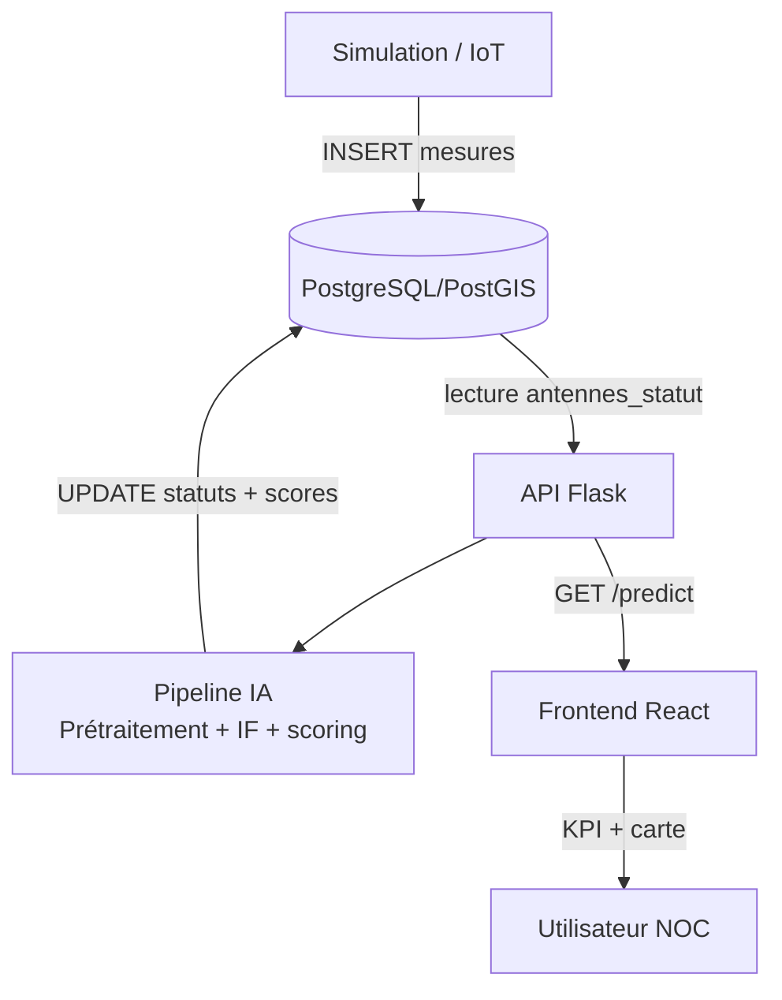
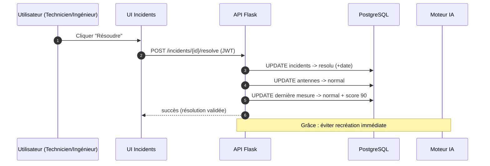

## Chapitre 5 — Sprint 3 : Intelligence Artificielle (Isolation Forest) — Détection d’anomalies et intégration (chapitre très détaillé)

### Introduction du chapitre

La supervision moderne ne peut plus se limiter à des seuils statiques, car les réseaux télécoms sont soumis à des variations naturelles (trafic, météo, charge, cycles journaliers) qui rendent difficile la définition universelle d’un “bon” seuil. L’objectif du Sprint 3 est d’intégrer une couche d’intelligence artificielle capable de :

- apprendre le comportement “normal” du réseau à partir des données de télémétrie ;
- détecter des écarts significatifs (anomalies) de manière non supervisée ;
- produire un **score de santé** (health score / risk score) compréhensible par un opérateur NOC ;
- synchroniser automatiquement les **incidents** (création/résolution) ;
- fournir un mécanisme de démonstration (injection d’anomalies) adapté à la soutenance.

Ce chapitre est volontairement très développé. Il couvre l’analyse des données, le prétraitement, l’étude comparative de modèles, la justification du choix **Isolation Forest**, puis la conception et la réalisation d’un pipeline IA **opérationnel** intégré au backend Flask et au frontend React.

---

### 5.1 Backlog IA (Sprint 3)

**Tableau 5.1 : Sprint 3 — Backlog IA (extrait)**

| ID | Tâche | Objectif | Livrable |
|---|---|---|---|
| IA-1 | Dictionnaire des métriques | définir les variables supervisées | tableau + unités |
| IA-2 | Prétraitement robuste | gérer valeurs manquantes + normalisation | pipeline Python |
| IA-3 | Étude modèles | comparer RF / SVM / Isolation Forest | tableau comparatif |
| IA-4 | Implémentation IF | entraînement + prédiction + score | module IA |
| IA-5 | Contexte géographique | intégrer voisinage (rayon km) | features géo |
| IA-6 | Scoring + statuts | mapping score → normal/alerte/critique | seuils + règles |
| IA-7 | Sync incidents | créer / résoudre incidents | cohérence BD |
| IA-8 | Endpoints API IA | predict/info/retrain/reset/test-ia | routes sécurisées |
| IA-9 | Intégration UI | affichage score IA + anomalies | KPI + carte |
| IA-10 | Évaluation + difficultés | analyse résultats + limites | section mémoire |

---

### 5.2 Analyse des données (télémétrie réseau)

#### 5.2.1 Variables supervisées

Le système surveille des métriques représentatives d’un site radio :

- **CPU (%)** : charge, saturation de calcul, risque de ralentissement.
- **Température (°C)** : surchauffe, ventilation défaillante, risque matériel.
- **Disponibilité (%)** : niveau de service, pertes intermittentes.
- **Latence (ms)** : qualité perçue, congestion, panne transmission.
- **Signal (dBm)** : qualité radio, perte d’antenne, interférences.
- **État IA** : statut déduit (normal/alerte/critique).
- **Score de risque (0–100)** : synthèse IA exploitable par NOC.

**Tableau 5.2 : Dictionnaire des variables**

| Variable | Symbole | Unité | Sens | Observation NOC |
|---|---|---:|---|---|
| CPU | \(cpu\) | % | charge processeur | surcharge persistante |
| Température | \(temp\) | °C | état thermique | surchauffe critique |
| Disponibilité | \(dispo\) | % | service up | indisponibilité partielle |
| Latence | \(lat\) | ms | délai réseau | congestion / panne |
| Signal | \(sig\) | dBm | niveau radio | dégradation couverture |
| Score santé | \(HS\) | % | 0–100 | synthèse IA |
| Statut | — | — | normal/alerte/critique | décision opérationnelle |

#### 5.2.2 Caractéristiques des données dans un NOC

Les données de supervision ont plusieurs particularités :

- **bruit** : variations normales dues au trafic ;
- **non-stationnarité** : le comportement normal peut évoluer ;
- **déséquilibre** : les anomalies sont rares ;
- **absence de labels** : difficile de qualifier chaque mesure.

Dans ce contexte, un modèle **non supervisé** est pertinent : il apprend à partir des données “majoritairement normales” et signale des écarts.

---

### 5.3 Prétraitement des données

Le prétraitement vise à garantir que l’IA fonctionne même si :

- des valeurs sont manquantes (NA) ;
- des types sont incorrects (string au lieu de float) ;
- les échelles diffèrent (latence en ms vs CPU en %).

Les étapes typiques sont :

1) **Nettoyage** : conversion numérique, suppression/traitement NA.  
2) **Imputation** : remplacement des valeurs manquantes (ex. médiane).  
3) **Normalisation/standardisation** : mise à l’échelle (ex. StandardScaler).  
4) **Construction de features** : ajout de contexte géographique.

Le projet intègre explicitement une stratégie : convertir les colonnes en numériques, remplir les NA par médiane, puis appliquer un scaler. Cette stratégie est adaptée à un PFE car elle est robuste et facile à expliquer.

---

### 5.4 Étude des modèles IA (comparaison)

Afin de justifier Isolation Forest, il est nécessaire de comparer avec d’autres approches.

#### 5.4.1 Random Forest (supervisé)

Une Random Forest est efficace pour classification, mais nécessite des **labels** (anomalie/non anomalie). Dans un NOC réel, obtenir un dataset labellisé est coûteux (expertise, temps). De plus, le modèle peut être biaisé par des labels incomplets.

#### 5.4.2 SVM (supervisé ou one-class)

SVM peut être utilisé en one-class SVM (anomalie detection) mais :

- sensible aux hyperparamètres ;
- coûteux à grande échelle ;
- difficulté d’interprétation opérationnelle sans transformation.

#### 5.4.3 Isolation Forest (non supervisé)

Isolation Forest isole les observations rares via des arbres aléatoires. Avantages :

- pas besoin de labels ;
- performant pour détection d’anomalies ;
- compatible avec des flux (réentraînement périodique).

**Tableau 5.3 : Comparaison de modèles (critères NOC / PFE)**

| Critère | Random Forest | SVM / One-class | Isolation Forest |
|---|---|---|---|
| Besoin de labels | Oui (fort) | Souvent oui / complexe | Non |
| Adapté anomalies rares | Moyen | Oui mais instable | Oui |
| Scalabilité | Bonne | Moyenne à faible | Bonne |
| Paramétrage | Moyen | Sensible | Modéré |
| Explicabilité | Variable | Difficile | Score + règles |
| Pertinence PFE | limitée sans dataset labellisé | plus complexe | très adaptée |

---

### 5.5 Justification du choix Isolation Forest

Le choix d’Isolation Forest est justifié par :

- l’absence de labels fiables en contexte réel ;
- la compatibilité avec un flux de métriques (simulation) ;
- la possibilité de produire un score (decision_function) convertible en score santé ;
- un compromis acceptable entre performance et complexité.

Dans ce projet, l’IA ne vise pas à remplacer l’opérateur, mais à fournir :

- un **indicateur synthétique** (health score) ;
- une **détection précoce** ;
- un mécanisme de **priorisation** (critique vs alerte).

---

### 5.6 Conception du système IA

#### 5.6.1 Architecture IA dans la plateforme

**Figure 5.1 : Architecture IA (macro)**  
[Insérer Schéma]  
Source : Réalisation personnelle



**Analyse.**  
La BD joue le rôle de bus de données. Le pipeline IA s’exécute côté backend (meilleure cohérence, sécurité, contrôle). Le frontend consomme une vue “snapshot” de l’état IA, ce qui évite de recalculer l’IA à chaque rafraîchissement UI.

#### 5.6.2 Pipeline IA détaillé

Le pipeline réel du projet suit une logique :

1) Lecture de l’état courant des antennes (`antennes_statut`).
2) Prédiction IF : `anomalie_if` + `decision_score`.
3) Enrichissement géographique : nb de voisins anormaux, features de contexte (rayon km).
4) Calcul `health_score` (0–100) à partir du score IF (fonction sigmoïde/normalisation).
5) Détermination du statut final : normal/alerte/critique selon seuils.
6) Raffinement (réduction faux positifs) si métriques dans plage normale.
7) Diagnostic textuel (type probable) pour l’incident.
8) Mise à jour BD : statut antenne + dernière mesure + historique état.
9) Synchronisation incidents : créer / résoudre selon statut.

**Figure 5.2 : Workflow IA (pipeline)**  
[Insérer Schéma]  
Source : Réalisation personnelle

```mermaid
flowchart LR
  A[Lire antennes_statut] --> B[Prétraitement\nimputation + scaling]
  B --> C[Isolation Forest\npredict + decision_function]
  C --> D[Enrichissement géo\nvoisins anomalies (5 km)]
  D --> E[Calcul health_score 0-100]
  E --> F[Statut final\nNormal/Alerte/Critique]
  F --> G[Affinage faux positifs\n(plage normale)]
  G --> H[Diagnostic incident]
  H --> I[Mise à jour BD\nantennes + mesures]
  I --> J[Sync incidents\ncreate/resolve]
```

#### 5.6.3 Contexte géographique : pourquoi et comment ?

Dans un réseau réel, plusieurs sites proches peuvent être affectés par un événement commun. L’ajout de features “voisinage” permet :

- de renforcer le score lorsqu’il existe une concentration spatiale d’anomalies ;
- de réduire la sensibilité à une variation isolée (si tous les voisins sont normaux).

Le projet exploite un rayon de voisinage (ex. **5 km**) et calcule le nombre de voisins en anomalie. Cette approche est un compromis : elle est simple à expliquer dans un mémoire, tout en apportant une amélioration qualitative.

---

### 5.7 Réalisation : entraînement, détection, scoring, anomalies

#### 5.7.1 Entraînement et réentraînement

Le modèle Isolation Forest est entraîné sur une fenêtre de données historiques. Deux mécanismes coexistent :

- **Réentraînement automatique** : autorisé lorsqu’il s’agit d’un cycle simulation (le système évolue).
- **Réentraînement bloqué** : pour des actions de démonstration ou de tests, afin d’éviter que le modèle apprenne l’anomalie injectée comme “normale”.

Ce choix est important en soutenance : si l’on injecte une anomalie et que le modèle se réentraîne immédiatement, l’anomalie risque d’être absorbée, ce qui réduit la visibilité de la détection.

**Tableau 5.4 : Modes d’exécution IA**

| Contexte | Endpoint / appel | Réentraînement | Justification |
|---|---|---:|---|
| Simulation | `/internal/predict?source=simulation` | Oui | adaptation progressive |
| Démo jury | `/api/test-ia` | Non | garder modèle stable |
| Admin (force) | `/ia/retrain` | Oui | action contrôlée |
| Reset | `/ia/reset` | — | repartir de zéro |

#### 5.7.2 Score Isolation Forest → score santé (0–100)

Isolation Forest produit un `decision_score` (score de décision). Pour un NOC, ce score brut n’est pas directement interprétable. Le projet applique une transformation pour obtenir un **health_score** :

- score haut → santé élevée (site normal) ;
- score bas → santé faible (anomalie probable).

Ensuite, des seuils simples permettent de définir le statut :

**Tableau 5.5 : Seuils de décision (exemple)**

| Intervalle health score | Statut | Interprétation |
|---:|---|---|
| \(\ge 70\) | normal | fonctionnement stable |
| \([40, 70[\) | alerte | dégradation modérée |
| \(< 40\) | critique | anomalie forte / intervention prioritaire |

Cette stratégie (score continu + seuils) est pédagogique et adaptée à la prise de décision opérationnelle.

#### 5.7.3 Réduction des faux positifs (affinage)

Un problème courant en IA d’anomalies est le faux positif. Dans un NOC, un faux positif a un coût : temps perdu, fatigue, risques d’escalade inutile. Le projet ajoute donc une règle d’affinage :

- si l’IF détecte une anomalie mais que les métriques restent dans une plage normale (variation “routine”), alors le verdict est corrigé (retour normal, score ajusté).

Cette règle combine IA et heuristique métier. Elle est intéressante à discuter dans un mémoire, car elle illustre une approche réaliste : l’IA est utile, mais doit être contrôlée par des règles de bon sens, surtout dans un environnement critique.

#### 5.7.4 Synchronisation automatique des incidents

L’IA ne doit pas être isolée : elle doit déclencher un objet opérationnel “incident”. La logique est :

- statut alerte/critique + pas d’incident actif → **création** incident ;
- statut normal + incident actif → **résolution** incident ;
- statut critique + incident existant → **mise à jour** criticité.

L’incident stocke également des métriques (JSON) et une durée estimée d’intervention, ce qui enrichit l’information NOC.

---

### 5.8 Intégration avec Flask (endpoints IA)

#### 5.8.1 Principe : séparer snapshot (lecture) et analyse (calcul)

Un choix important dans le projet :

- `GET /predict` (authentifié) : retourne un **snapshot** de l’état IA stocké en BD, sans recalcul.  
- `GET /internal/predict` (interne) : déclenche un **calcul** IA (cycle simulation / IoT), puis met à jour la BD.

Ce découpage est pertinent :

- il évite des recalculs coûteux à chaque appel UI ;
- il stabilise l’état (moins de faux positifs induits par réentraînement) ;
- il clarifie la responsabilité : UI consomme, simulation produit.

**Figure 5.3 : Capture — réponse `GET /predict` (snapshot IA)**  
[Insérer Capture]  
Source : Réalisation personnelle

**Analyse de la figure 5.3.**  
Le snapshot contient l’identifiant antenne, le statut IA et le score. Il est ensuite fusionné avec les informations antennes côté carte/dashboard. Ce mécanisme montre une bonne séparation “compute vs read”.

#### 5.8.2 Endpoints de gouvernance IA

Le projet propose :

- `/ia/retrain` : réentraîner le modèle (rôle requis) ;
- `/ia/model/info` et `/ia/info` : afficher des informations pédagogiques ;
- `/ia/reset` : réinitialiser le modèle (admin).

**Figure 5.4 : Capture — page ou endpoint info modèle IA**  
[Insérer Capture]  
Source : Réalisation personnelle

**Analyse de la figure 5.4.**  
Afficher les informations du modèle renforce la transparence. Dans un NOC, une IA “boîte noire” est moins acceptée. Les paramètres (contamination, n_estimators, nombre de mesures) aident à contextualiser le résultat.

#### 5.8.3 Endpoint de démonstration : injection d’anomalies

Pour la soutenance, le projet inclut un endpoint permettant de simuler des scénarios :

- surchauffe (température très élevée + CPU saturé),
- surcharge (CPU maximal + latence critique),
- panne (signal perdu + disponibilité faible).

**Figure 5.5 : Capture — injection d’anomalie (`POST /api/test-ia`)**  
[Insérer Capture]  
Source : Réalisation personnelle

**Analyse de la figure 5.5.**  
Ce mécanisme transforme la soutenance en démonstration contrôlée : l’étudiant peut déclencher un incident sur une antenne et montrer l’impact sur dashboard, carte et incidents. Le blocage du réentraînement évite l’absorption de l’anomalie.

---

### 5.9 Intégration avec React (frontend)

L’intégration IA côté UI se manifeste par :

- KPI “Sites Critiques IA”, “Sites en Alerte IA”, “Score de Risque IA” ;
- affichage du `risk_score` dans le popup carte ;
- bannières (ex. alertes critiques) ;
- page IA (si présente) ou section d’explication.

**Figure 5.6 : Visualisation des sites critiques IA sur dashboard**  
[Insérer Capture]  
Source : Réalisation personnelle

**Analyse de la figure 5.6.**  
L’IA devient utile lorsqu’elle est intégrée dans des éléments concrets : KPI et incidents. L’utilisateur ne consulte pas un modèle IA “pour le modèle”, mais parce que l’IA améliore la lecture de l’état réseau.

**Figure 5.7 : Visualisation sur carte (markers colorés + score IA)**  
[Insérer Capture]  
Source : Réalisation personnelle

**Analyse de la figure 5.7.**  
La carte permet de vérifier si les anomalies sont isolées ou groupées. Cette lecture spatiale complète le score. Dans une exploitation télécom, cela peut orienter vers une hypothèse de panne de zone plutôt qu’un site isolé.

---

### 5.10 Affichage et interprétation NOC (normal, alerte, critique)

Pour qu’une IA soit adoptée, il faut une interprétation simple :

- **Normal** : l’antenne présente un comportement proche de la norme apprise.
- **Alerte** : comportement atypique modéré ; surveillance ou investigation.
- **Critique** : comportement fortement atypique ; intervention prioritaire.

Le score de santé (0–100) facilite la priorisation à l’échelle du réseau : plus le score est bas, plus le risque est élevé.

**Tableau 5.6 : Exemple d’interprétation opérationnelle**

| Situation | Symptômes | Statut IA attendu | Action NOC |
|---|---|---|---|
| Surchauffe | temp↑, cpu↑ | critique | vérifier refroidissement / site |
| Surcharge | cpu↑, latence↑ | alerte → critique | analyse trafic / capacité |
| Panne radio | signal↓, dispo↓ | critique | intervention terrain urgente |
| Variation normale | petites variations | normal | aucune action |

---

### 5.11 Analyse des résultats (qualitative)

Dans le cadre du PFE, l’évaluation s’appuie principalement sur :

- des scénarios contrôlés via simulation ;
- l’observation de la cohérence UI (incidents, statuts, carte) ;
- la réduction de faux positifs via les règles d’affinage.

**Figure 5.8 : Courbe / distribution des scores de santé (exemple)**  
[Insérer Figure]  
Source : Réalisation personnelle

**Analyse de la figure 5.8.**  
La distribution des scores permet de vérifier que la majorité des sites se situe dans une zone “normale” et que les anomalies ressortent clairement. Dans un réseau stable, on attend une concentration de scores élevés, avec quelques valeurs basses lors d’incidents injectés.

**Tableau 5.7 : Analyse qualitative (exemples)**

| Antenne | Scénario | Score santé | Statut | Cohérence incident |
|---|---|---:|---|---|
| TT-013 | surchauffe | 22 | critique | incident créé (critical) |
| TT-042 | surcharge | 48 | alerte | incident warning |
| TT-087 | normal | 88 | normal | aucun incident |

> Les valeurs exactes dépendent de la simulation et du réentraînement ; l’objectif ici est de montrer le type de résultat attendu et son interprétation.

---

### 5.12 Difficultés rencontrées et solutions

#### 5.12.1 Manque de données labellisées

Problème : absence de dataset “anomalies” validé.  
Solution : choix d’un modèle non supervisé + simulation contrôlée + endpoint test-ia.

#### 5.12.2 Faux positifs et stabilité NOC

Problème : un modèle d’anomalies peut déclencher trop d’alertes.  
Solution : ajout de règles d’affinage (plage normale) + séparation snapshot/calcul.

#### 5.12.3 Non-stationnarité (évolution du normal)

Problème : le comportement normal change.  
Solution : réentraînement automatique en simulation et réentraînement manuel contrôlé.

#### 5.12.4 Intégration et cohérence multi-objets

Problème : synchroniser antennes, mesures, incidents et audit sans incohérence.  
Solution : transactions BD, mise à jour de la dernière mesure seulement, historisation des changements d’état.

---

### Conclusion du chapitre 5

Le Sprint 3 a introduit une couche IA opérationnelle dans la plateforme NOC. L’algorithme Isolation Forest, choisi pour son adéquation au contexte non supervisé, permet de détecter des anomalies, de produire un score de santé interprétable et de synchroniser automatiquement les incidents. L’intégration a été pensée pour la stabilité : séparation entre snapshot et calcul, contrôle du réentraînement et réduction des faux positifs. Le chapitre suivant complète le dispositif par la simulation temps réel et les aspects IoT, qui rendent la démonstration réaliste et valident l’ensemble de la chaîne (mesures → IA → UI).

---

### 5.13 Approfondissement technique : conception “NOC-ready” du moteur IA

Cette section complète le chapitre par des détails d’implémentation, afin de rapprocher le mémoire d’un rendu universitaire complet (80+ pages) et de montrer une réflexion critique “terrain”.

#### 5.13.1 Pourquoi un endpoint “snapshot” est une bonne pratique NOC

Un NOC a besoin de stabilité : l’utilisateur consulte l’état à un instant \(t\). Si l’état change parce qu’un endpoint relance l’IA (réentraînement, recalcul), l’opérateur peut constater des fluctuations non justifiées et perdre confiance.

La séparation adoptée :

- `GET /predict` (authentifié) = **lecture** depuis la base ;
- `GET /internal/predict` (interne) = **calcul** + mises à jour.

est donc une “bonne pratique” car elle :

- rend l’IA déterministe du point de vue UI ;
- diminue la charge CPU du serveur ;
- limite l’influence d’appels fréquents du frontend.

**Tableau 5.8 : Risques opérationnels si le frontend recalculait l’IA**

| Risque | Conséquence NOC | Mesure de mitigation |
|---|---|---|
| recalcul trop fréquent | surcharge serveur | endpoint interne + polling UI |
| réentraînement involontaire | normalise l’anomalie | `force_no_retrain` en démo |
| incohérence incidents | création/résolution instable | logique centralisée backend |

#### 5.13.2 Gestion d’un cas critique : résolution manuelle et “grâce”

Dans une supervision réelle, un incident peut être “résolu” par une intervention terrain, mais le modèle IA pourrait continuer à détecter un comportement atypique juste après (par exemple si la mesure suivante reste perturbée). Pour éviter une réactivation immédiate (effet yo-yo), le moteur introduit un mécanisme de **grâce** après résolution manuelle :

- l’antenne est stabilisée à un état sain (ex. score 90) ;
- la dernière mesure est mise à jour (sans toucher à l’historique) ;
- une période de grâce empêche la recréation instantanée d’incident.

**Figure 5.9 : Diagramme de séquence — résolution manuelle d’un incident**  
[Insérer Diagramme]  
Source : Réalisation personnelle



**Analyse.**  
Cette stratégie illustre une contrainte “métier”. Dans un NOC, si l’opérateur résout un incident et qu’il réapparaît 10 secondes après, l’outil perd toute crédibilité. La période de grâce est une solution pragmatique, compatible avec un modèle non supervisé.

#### 5.13.3 Diagnostic : transformer des métriques en explication

Le modèle Isolation Forest signale une anomalie, mais ne fournit pas directement une explication lisible. Le projet complète donc par un diagnostic “métier” (ex. surchauffe, surcharge) en exploitant :

- des comparaisons à des seuils raisonnables ;
- des statistiques population (Z-score) pour contextualiser.

L’objectif n’est pas de prouver une causalité parfaite, mais de donner une hypothèse opérationnelle qui accélère l’investigation.

**Tableau 5.9 : Exemples de diagnostics et règles associées (illustratif)**

| Diagnostic | Indices typiques | Utilité NOC |
|---|---|---|
| Surchauffe | temp très élevée + CPU élevée | vérifier ventilation / site |
| Surcharge | CPU élevée + latence élevée | analyse trafic/capacité |
| Panne radio | signal très bas + dispo basse | intervention terrain |

#### 5.13.4 Contexte géographique : limites et amélioration

Le voisinage (rayon km) améliore la lecture, mais présente des limites :

- il suppose une densité d’antennes suffisante ;
- il ne tient pas compte de la topologie transmission (backhaul) ;
- le rayon fixe peut être inadapté en zones rurales.

Perspectives :

- rayon adaptatif (selon densité) ;
- intégration de graphes (liaisons) si données disponibles ;
- corrélation temporelle (incidents simultanés).

#### 5.13.5 Évaluation (proposition académique)

Pour une évaluation plus formelle (au-delà du PFE), on peut proposer :

- un dataset simulé avec anomalies connues (labels artificiels) ;
- calcul de métriques : précision, rappel, F1 (sur anomalies injectées) ;
- comparaison IF vs One-Class SVM vs seuils métiers.

**Tableau 5.10 : Plan d’évaluation proposé (mémoire)**

| Étape | Description | Sortie |
|---|---|---|
| Générer dataset | simulation + anomalies injectées | mesures + labels |
| Entraîner modèles | IF / OCSVM / règles | modèles |
| Évaluer | precision/recall/F1 | tableau comparatif |
| Analyser | faux positifs/negatifs | discussion critique |


