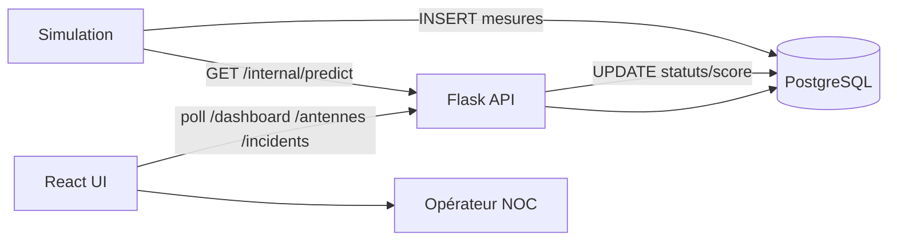

## Chapitre 6 — Sprint 4 : Simulation, IoT et mécanismes temps réel

### Introduction du chapitre

Un système de supervision NOC se justifie par sa capacité à traiter un flux continu de métriques. Or, dans un cadre PFE, l’accès à un flux réel (équipements terrain, sondes, systèmes industriels) est souvent limité pour des raisons de sécurité et d’exploitation. Il est donc indispensable de construire un mécanisme de **simulation** capable de :

- générer automatiquement des mesures réalistes (CPU, température, latence, etc.) ;
- injecter des scénarios d’anomalies (surcharge, surchauffe, panne) ;
- alimenter la base PostgreSQL et déclencher le pipeline IA ;
- fournir au frontend un comportement “temps réel” cohérent.

En parallèle, ce chapitre présente une vision IoT (capteurs/Arduino) et un schéma de flux de données, même si l’intégration matérielle peut rester optionnelle selon les contraintes de stage.

---

### 6.1 Backlog du sprint (Sprint 4)

**Tableau 6.1 : Sprint 4 — Backlog (extrait)**

| ID | Fonction | Description | Résultat attendu |
|---|---|---|---|
| S4-1 | Générateur métriques | mesures périodiques par antenne | BD alimentée |
| S4-2 | Scénarios anomalies | surcharge/surchauffe/panne | incidents IA visibles |
| S4-3 | Déclencheur IA | cycle global (toutes antennes) | statuts cohérents |
| S4-4 | Flux IoT (optionnel) | ingestion métriques via API key | sécurité minimale |
| S4-5 | Optimisation temps réel | fréquences de polling | UI stable |

---

### 6.2 Analyse : pourquoi la simulation est essentielle dans un PFE NOC ?

La simulation apporte plusieurs avantages académiques et techniques :

- elle remplace l’absence de données réelles, tout en restant contrôlée ;
- elle permet la reproductibilité (mêmes scénarios pour le jury) ;
- elle offre un support d’évaluation : vérifier que l’IA détecte bien une anomalie injectée ;
- elle valide l’intégration bout-en-bout (DB → IA → incidents → UI).

Dans une plateforme NOC, la valeur n’est pas seulement dans un algorithme IA, mais dans la cohérence de l’ensemble. La simulation joue donc le rôle de “capteur virtuel”.

---

### 6.3 Conception : architecture de flux (données et temps réel)

#### 6.3.1 Architecture de flux (pipeline runtime)

**Figure 6.1 : Schéma simulation temps réel (génération → BD → IA → UI)**  
[Insérer Schéma]  
Source : Réalisation personnelle



**Analyse de la figure 6.1.**  
Le cycle “mesures → IA → statuts → UI” reproduit un flux NOC réel. Le frontend reste en lecture, tandis que la simulation joue le rôle de producteur. Cette séparation réduit le couplage et améliore la stabilité.

#### 6.3.2 Conception IoT (vision)

Même si le PFE repose principalement sur simulation, une extension IoT est plausible :

- capteurs (température, tension, etc.) ;
- microcontrôleur (Arduino/ESP) ;
- envoi périodique vers l’API ;
- stockage en BD puis analyse IA.

**Figure 6.2 : Architecture IoT (capteurs → API → BD → IA → UI)**  
[Insérer Schéma]  
Source : Réalisation personnelle

```mermaid
flowchart TB
  CAP[Capteurs (temp, énergie, etc.)] --> MCU[Arduino/ESP]
  MCU -->|HTTP + API key| API[Flask API /iot/...]
  API --> DB[(PostgreSQL/PostGIS)]
  DB --> IA[Isolation Forest]
  IA --> DB
  FE[Dashboard/Carte React] --> API
```

**Analyse de la figure 6.2.**  
L’ajout d’une clé API IoT est une première mesure de sécurité : seuls des dispositifs autorisés peuvent pousser des données. Dans un contexte industriel, on renforcerait la sécurité (TLS mutualisé, rotation clés, certificats).

---

### 6.4 Réalisation : simulation et scénarios

#### 6.4.1 Génération automatique des métriques

Les métriques doivent être plausibles :

- CPU : variation autour d’une moyenne (ex. 30–60%), avec pics possibles.
- Température : dépend du CPU et du climat (ex. 25–45°C normal, anomalies > 60°C).
- Signal : autour de -65 dBm (avec anomalies -110 dBm).
- Latence : autour de 10–30 ms (avec anomalies > 200 ms).
- Disponibilité : proche de 99% (avec anomalies < 70%).

**Tableau 6.2 : Scénarios de simulation**

| Scénario | Symptômes | Objectif de démo |
|---|---|---|
| Normal | métriques stables | base “sain” pour entraînement |
| Surchauffe | temp↑, cpu↑ | incident critique IA |
| Surcharge | cpu↑, latence↑ | alerte → critique |
| Panne | signal↓, dispo↓, latence↑ | incident critique |

**Figure 6.3 : Capture — évolution de mesures simulées dans PostgreSQL**  
[Insérer Capture]  
Source : Réalisation personnelle

**Analyse de la figure 6.3.**  
La table `mesures` contient un historique ; chaque antenne possède un ensemble de points. Cette structure permet au frontend de tracer des courbes, et au backend IA de réentraîner périodiquement le modèle.

#### 6.4.2 Déclenchement IA en cycle (interne)

Le simulateur déclenche l’analyse via un endpoint interne (`/internal/predict`). Cela permet d’éviter que l’UI relance des calculs lourds. Dans une évolution future, on pourrait transformer ce mécanisme en worker (Celery/Redis) ou planificateur, mais la solution actuelle reste adaptée à un PFE : simple, explicable et fonctionnelle.

**Figure 6.4 : Capture — logs d’analyse IA globale (cycle simulation)**  
[Insérer Capture]  
Source : Réalisation personnelle

**Analyse de la figure 6.4.**  
Les logs résument le nombre de sites normaux/alertes/critiques. Cela sert à valider rapidement que le système réagit lorsque l’on injecte des scénarios.

---

### 6.5 Analyse critique (Sprint 4)

#### 6.5.1 Validité de la simulation

La simulation ne remplace pas totalement le réel. Ses limites :

- elle ne capture pas toutes les causes (panne transmission complexe, interférences radio réelles) ;
- elle peut simplifier les distributions et corrélations.

Cependant, dans un PFE, elle est acceptable car elle permet de démontrer l’architecture, l’intégration et la logique IA.

#### 6.5.2 Temps réel : polling vs push

Le système s’appuie majoritairement sur polling :

- avantages : simplicité, robustesse, débogage facile.
- inconvénients : latence de rafraîchissement, charge croissante.

Perspective : utiliser WebSocket/SSE pour pousser les événements critiques (incidents) au frontend.

---

### Conclusion du chapitre 6

Le Sprint 4 a consolidé l’aspect temps réel du projet grâce à une simulation continue, capable de produire des métriques et de déclencher le pipeline IA. Il a également proposé une architecture IoT plausible, montrant comment des capteurs réels pourraient alimenter la plateforme. Cette étape renforce la crédibilité du système et prépare la conclusion générale, qui synthétise les résultats, les compétences acquises et les perspectives.

