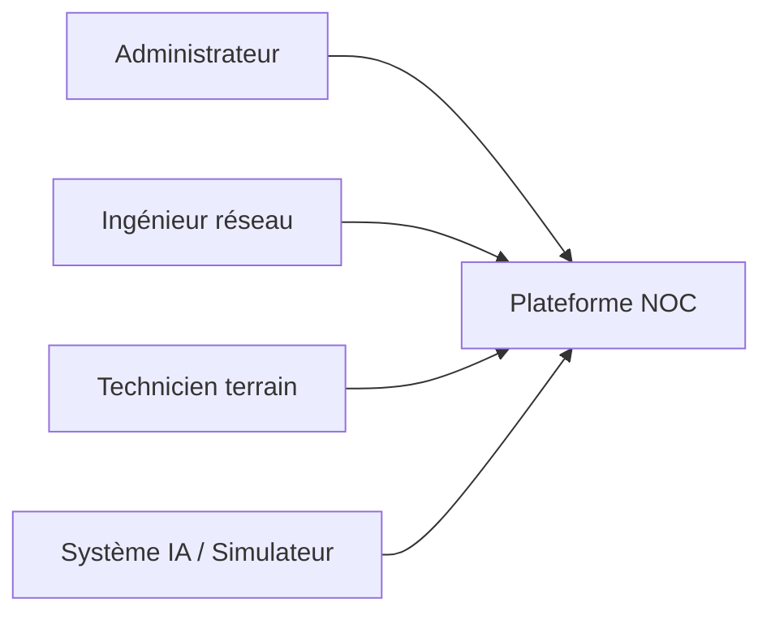

# CHAPITRE 2 : PRÉPARATION DU PROJET

## Introduction du chapitre

La phase de préparation constitue le socle méthodologique et technique du PFE. Elle traduit les besoins exprimés par le centre de Mahdia en spécifications formalisées, modèles UML et choix d'architecture. Ce chapitre expose les besoins fonctionnels et non fonctionnels, la modélisation, l'organisation Scrum et l'environnement de développement.

---

## 2.1 Capture des besoins

### 2.1.1 Besoins fonctionnels

Les besoins fonctionnels décrivent ce que le système doit faire du point de vue de l'utilisateur métier.

**BF1 — Authentification et autorisation**

L'utilisateur doit pouvoir se connecter avec identifiant et mot de passe. Le système émet un **token JWT** valide pour les appels API subséquents. Trois rôles principaux structurent les droits :

| Rôle | Code technique | Droits principaux |
|------|----------------|-------------------|
| Administrateur | `administrateur` | Utilisateurs, paramètres, audit, métriques antennes |
| Ingénieur réseau | `ingenieur_reseau` | Incidents, résolution, carte, rapports |
| Technicien terrain | `technicien_terrain` | Consultation, commentaires, messagerie |

**BF2 — Tableau de bord NOC**

Affichage synthétique : nombre d'antennes, incidents ouverts, disponibilité moyenne, graphique d'historique sur 12 heures, liste des derniers incidents, cartographie miniature.

**BF3 — Gestion des antennes**

Consultation liste filtrable et triable ; détail par antenne ; historique des mesures ; modification des métriques (admin) déclenchant le pipeline IA.

**BF4 — Gestion des incidents**

Liste des incidents avec statut (*en_cours*, *resolu*) ; création automatique par l'IA ; résolution manuelle ; commentaires et modération.

**BF5 — Carte réseau interactive**

Visualisation Leaflet des antennes colorées selon le statut ; pop-up métriques ; filtres par état.

**BF6 — Module intelligence artificielle**

Analyse des mesures ; classification ; score de risque ; réentraînement périodique du modèle.

**BF7 — Administration**

CRUD utilisateurs ; paramètres système ; consultation logs admin.

**BF8 — Journal d'audit**

Enregistrement automatique des actions sensibles ; consultation filtrée ; export CSV.

**BF9 — Messagerie interne**

Canal public NOC ; messages privés entre utilisateurs ; indicateur de non-lus.

**BF10 — Rapports**

Export PDF quotidien, rapport incidents, export Excel antennes, exports CSV.

**Tableau 2.1 — Priorisation MoSCoW**

| ID | Besoin | Priorité |
|----|--------|----------|
| BF1–BF5 | Cœur supervision | Must |
| BF6 | IA | Must |
| BF7–BF8 | Gouvernance | Should |
| BF9–BF10 | Collaboration / reporting | Could |

### 2.1.2 Besoins non fonctionnels

**BNF1 — Sécurité** : mots de passe hashés (Werkzeug), JWT signé, contrôle d'accès par décorateurs Flask (`@token_required`, `@admin_required`).

**BNF2 — Performance** : réponses API < 2 s pour la liste des antennes ; rafraîchissement frontend sans rechargement complet.

**BNF3 — Disponibilité** : healthchecks Docker ; redémarrage automatique des conteneurs.

**BNF4 — Maintenabilité** : séparation routes / services / IA ; blueprints Flask.

**BNF5 — Portabilité** : déploiement Docker Compose reproductible.

**BNF6 — Traçabilité temporelle** : horodatage en fuseau **Africa/Tunis** pour messagerie, incidents et audit.

---

## 2.2 Modélisation

### 2.2.1 Acteurs



### 2.2.2 Diagramme de cas d'utilisation (extrait)

**Figure 2.1 : Diagramme de cas d'utilisation global**

```
        ┌─────────────────────────────────────┐
        │         Plateforme NOC              │
        │  ┌─────────┐  ┌──────────────────┐  │
Admin ──┼─►│ Gérer   │  │ Configurer IA    │  │
        │  │ users   │  └──────────────────┘  │
Ingénieur┼─►│ Résoudre│  ┌──────────────────┐  │
        │  │ incident│  │ Consulter carte  │  │
Technicien►│ Commenter│ └──────────────────┘  │
        │  └─────────┘  ┌──────────────────┐  │
Système ─┼────────────►│ Détecter anomalie│  │
        │              └──────────────────┘  │
        └─────────────────────────────────────┘
```

*Source : Réalisation personnelle — modélisation UML.*

### 2.2.3 Diagramme de classes simplifié

**Figure 2.2 : Diagramme de classes (entités principales)**

| Classe | Attributs clés | Relations |
|--------|----------------|-----------|
| Antenne | id, nom, zone, lat, lon, statut | 1—* Mesure, 1—* Incident |
| Mesure | temperature, cpu, signal, latence, disponibilite, risk_score | *—1 Antenne |
| Incident | titre, statut, criticite, date_creation | *—1 Antenne |
| Utilisateur | username, role, password_hash | — |
| AuditLog | utilisateur, action, cible | — |
| MessageChat | contenu, is_private | *—1 Utilisateur |

### 2.2.4 Modèle relationnel

Les tables PostgreSQL principales : `antennes`, `mesures`, `incidents`, `users`, `audit_logs`, `messages_chat`, `historique_etats`, `commentaires_incidents`. L'extension **PostGIS** ajoute la colonne `geom` de type `geometry(Point, 4326)` sur les antennes.

---

## 2.3 Scrum

### 2.3.1 Équipe et rôles

Binôme de développement avec répartition : backend/IA pour l'un, frontend/intégration pour l'autre, avec revue croisée systématique.

### 2.3.2 Backlog produit (extrait)

| User Story | Sprint |
|------------|--------|
| En tant qu'ingénieur je consulte la carte des antennes | 2 |
| En tant qu'admin je modifie les métriques pour tester l'IA | 3 |
| En tant qu'opérateur je reçois une alerte critique | 2–3 |
| En tant qu'admin j'exporte le journal d'audit | 2 |

### 2.3.3 Planification

**Tableau 2.4 — Planification des sprints**

| Sprint | Durée | Livrable principal |
|--------|-------|-------------------|
| Sprint 1 | S1–S4 | API + BDD + Docker |
| Sprint 2 | S5–S8 | Interface React complète |
| Sprint 3 | S9–S11 | Module IA intégré |
| Sprint 4 | S12–S13 | Simulation + IoT |

---

## 2.4 Environnement matériel et logiciel

**Matériel :** PC développement (16 Go RAM recommandés), serveur Docker local, Arduino Uno + DHT11 (optionnel).

**Logiciel :**

| Composant | Version / outil |
|-----------|-----------------|
| OS | Windows 10/11 ou Linux |
| Node.js | 18+ |
| Python | 3.10+ |
| PostgreSQL | 15 + PostGIS 3.4 |
| Docker Desktop | 4.x |
| IDE | VS Code / Cursor |
| Git | Contrôle de version |

*Note : le frontend est en **JavaScript (React 18)** avec feuilles de style CSS dédiées. Une migration TypeScript ou l'adoption de Tailwind CSS constituerait une évolution ultérieure non réalisée dans la version livrée.*

---

## 2.5 Architecture générale du système

**Figure 2.3 : Architecture logique trois tiers**

```
┌─────────────────────────────────────────────────────────┐
│  PRÉSENTATION — React (dashboard/)                       │
│  Pages : Dashboard, Map, Antennes, Incidents, Admin…    │
└────────────────────────┬────────────────────────────────┘
                         │ HTTP REST + JSON + JWT
┌────────────────────────▼────────────────────────────────┐
│  MÉTIER — Flask (api/)                                   │
│  Blueprints : auth, antennes, incidents, ia, chat…      │
│  Module ia/ : model, prediction, scoring, diagnostics   │
└────────────────────────┬────────────────────────────────┘
                         │ psycopg2 / SQL
┌────────────────────────▼────────────────────────────────┐
│  DONNÉES — PostgreSQL/PostGIS                            │
│  Tables + vues + index                                   │
└─────────────────────────────────────────────────────────┘
```

**Analyse :** Cette séparation permet de tester l'API indépendamment (Postman, curl) et de faire évoluer le frontend sans modifier le schéma de base, sous réserve de respecter le contrat REST.

---

## Conclusion du chapitre 2

La préparation du projet a formalisé dix familles de besoins fonctionnels et six exigences non fonctionnelles. La modélisation UML et relationnelle fournit une base stable pour les sprints de développement. L'architecture trois tiers, validée par l'encadrement, oriente les chapitres 3 à 6 vers une implémentation incrémentale et testable.

---

*Fin du chapitre 2 — environ 14 pages.*
